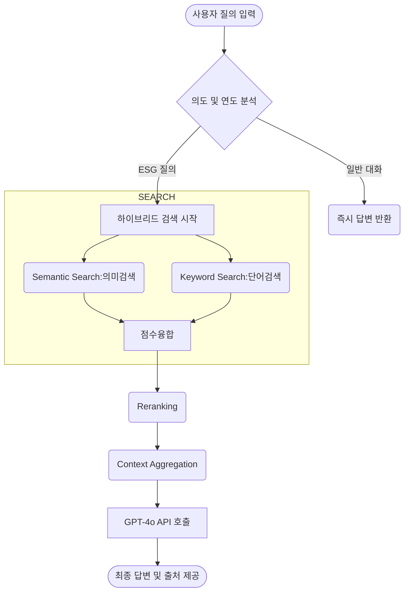

# ESG Dashboard 챗봇 RAG(검색 증강 생성) 처리 파이프라인

ESG Dashboard 챗봇은 단순 키워드 검색을 넘어 **하이브리드(의미+키워드) 검색**과 **딥러닝 기반 정밀 리랭킹(Reranking)** 을 적용하여, 기업의 ESG 보고서 내용에 대해 고도로 신뢰성 있는 답변을 생성합니다.

## 시스템 흐름도 (Mermaid)

## 전체 처리 파이프라인 상세표
| :--- | :--- | :--- | :--- |
| **1단계: 질의 분석 및 전처리** | 의도 판별 및 Small-talk 필터링 | `ai_service.py` (`_should_use_rag`, `_fast_path_response`) | "안녕", "고마워" 등 단순 인사말일 경우 RAG를 타지 않고 즉시 고정 답변 반환. |
| | 검색 연도 논리적 자동 추론 (Year Inference) | `ai_service.py` (`_infer_latest_report_year`) | 질문에 "작년", "지난해" 등이 있으면 자동으로 DB를 스캔하여 최신 보고서 연도의 전년도로 범위를 한정. |
| **2단계: 하이브리드 검색 및 리랭킹** | ① Semantic Search  (문장의 '의미' 검색) | `search_vector_db.py` (`semantic_search`)  `BAAI/bge-m3` 임베딩 모델 / Chroma DB | 사용자의 문장 전체를 벡터로 변환하여, 단어가 일치하지 않더라도 '유사한 의미'를 내포한 후보 문서를 Top-K개 넓게 추출. |
| | ② Keyword Search  (형태소 기반 '단어 일치' 검색) | `search_vector_db.py` (`keyword_search_full`)  `kiwipiepy` / BM25 알고리즘 | 한글 형태소 분석기(Kiwi)로 명사 등 키워드를 추출 후, BM25 알고리즘으로 단어 빈도수(정확도)가 높은 문서를 점수화. |
| | ③ Combined Scoring  (검색 점수 융합) | `search_vector_db.py` (`apply_combined_score`) | 각각의 검색 점수를 Min-Max 정규화(Scaling)한 뒤 가중합을 냄. (기본 가중치: 의미 검색 0.6 + 단어 검색 0.4) |
| | ④ Reranking  (Cross-Encoder 정밀 점수 재채점) | `search_vector_db.py` (`rerank_candidates`)  `BAAI/bge-reranker-v2-m3` 딥러닝 모델 | 결합 점수로 정렬된 후보들을 강력한 딥러닝 리랭킹 모델에 통과시킴. 단순 벡터 유사도를 떠나 '질문에 대한 진짜 해답이 존재하는가?'를 깊게 판단하여 순위를 재조정. |
| | ⑤ Context Aggregation  (페이지 단위 텍스트 병합 및 중복 제거) | `search_vector_db.py` (`aggregate_page_text`) | 최종 상위 결과 중 동일 페이지/문서의 데이터는 묶고, 작게 잘린 Chunk 단위 문장이 아니라 해당 페이지의 **전체 텍스트**로 조립하여 LLM에 넘길 문맥(Context)을 완성함. |
| **3단계: LLM 프롬프트 구성 및 답변** | 동적 프롬프트 병합 (Context + 시스템 프롬프트) | `ai_service.py` (`_build_messages`) | 1) ESG 전문가 페르소나 (시스템 프롬프트)  2) 이전 대화 기록 (Chat History)  3) 2단계에서 찾은 보고서 출처 (문맥)를 조립. |
| | GPT-4o 질의 및 스트리밍 응답 | `ai_service.py` (`stream_chat_response`) | GPT-4o를 호출하여 사실 기반 답변 도출. 마지막에 📚 참고 문헌(페이지 번호, 소스 정보 등)을 추가하여 프론트엔드로 전달. |

---

### 🔥 주요 특장점 정리
* **형태소 기반 하이브리드 검색**: "BGE-M3 (의미 기반)"과 "BM25 (키워드 기반)"을 혼합 적용해 문맥과 단어를 모두 놓치지 않습니다.
* **강력한 딥러닝 리랭킹 (Reranker)**: 1차로 가볍게 뽑아온 검색 결과들을 무거운 Cross-Encoder 모델(`BAAI/bge-reranker-v2-m3`)에 통과시켜 응답 품질/신뢰성을 두 배 이상 끌어올렸습니다.
* **조각난 문맥(Chunk) 손실 방지 처리**: RAG의 고질적인 단점(정답 문장이 반만 잘려 LLM에 전달되는 문제)을 막기 위해, 최종 후보로 선정된 Chunk가 속한 페이지의 전체 원문을 묶어 통째로 제공합니다.
