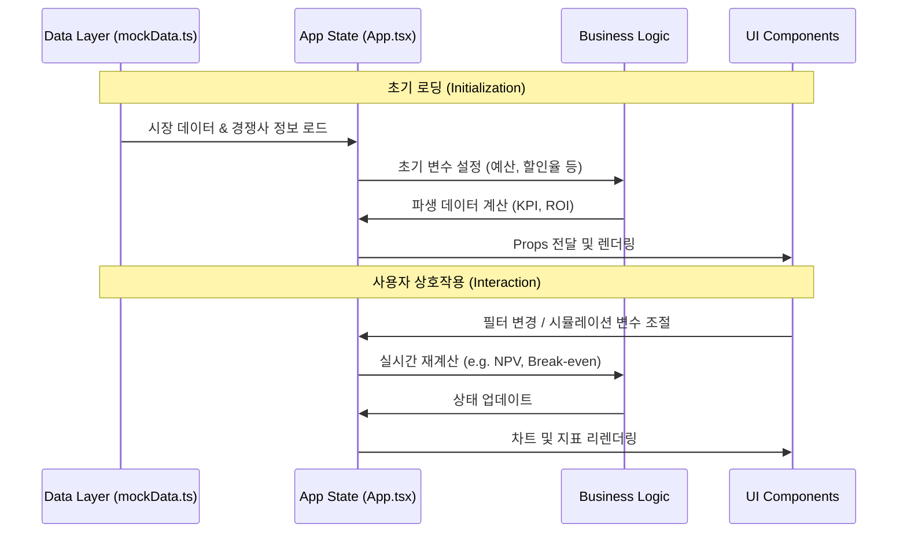

# ESG Carbon Dashboard (ESG 탄소 경영 대시보드)

이 프로젝트는 기업의 탄소 배출량 관리, 경쟁사 벤치마킹, 탄소세 시뮬레이션, 투자 전략 수립을 위한 통합 ESG 관리 플랫폼입니다. React와 TypeScript를 기반으로 구축되었으며, 기업의 지속가능경영 의사결정을 지원하는 직관적인 대시보드를 제공합니다.

---

## 🏗️ 시스템 아키텍처 및 구조도 (System Architecture)

이 애플리케이션은 **컴포넌트 기반 아키텍처**를 따르며, 최상위 `App` 컴포넌트가 전역 상태를 관리하고 하위 탭 컴포넌트에 데이터를 분배하는 중앙 집중식 구조를 가집니다.

### 1. 컴포넌트 계층 구조 (Component Hierarchy)

```mermaid
graph TD
    App[App.tsx (Main Container)]
    
    subgraph Layout
        Header[Header.tsx]
    end
    
    subgraph Features / Tabs
        Dash[DashboardTab]
        Comp[CompareTab]
        Sim[SimulatorTab]
        Tgt[TargetTab]
        Inv[InvestmentTab]
    end
    
    subgraph Shared UI (Design System)
        Card[Card.tsx]
        Btn[Button.tsx]
        Badge[Badge.tsx]
        Tooltip[CustomTooltip.tsx]
    end

    subgraph Chat Agent
        Chat[ChatBot.tsx]
    end

    App --> Header
    App --> Dash
    App --> Comp
    App --> Sim
    App --> Tgt
    App --> Inv
    App --> Chat
    
    Dash --> Card & Btn & Badge & Tooltip
    Comp --> Card & Btn & Badge & Tooltip
    Sim --> Card & Btn & Badge & Tooltip
    Tgt --> Card & Btn & Badge & Tooltip
    Inv --> Card & Btn & Badge & Tooltip
```

### 2. 데이터 흐름 파이프라인 (Data Pipeline)

애플리케이션 내 데이터는 정적 데이터(Mock Data)에서 시작하여 상태(State)로 가공된 후, 각 뷰(View)로 전달됩니다.



---

## 🌟 핵심 기능 및 모듈 (Core Modules)

| 모듈명 | 파일 위치 | 설명 | 주요 데이터 |
|:---:|:---:|:---|:---|
| **대시보드** | `tabs/DashboardTab.tsx` | 전체 배출 현황 및 KPI 요약 | 총 배출량, Scope 비중, 리스크 금액 |
| **비교 분석** | `tabs/CompareTab.tsx` | 경쟁사 벤치마킹 및 랭킹 | 탄소 집약도(매출/생산), 업계 평균 |
| **시뮬레이터** | `tabs/SimulatorTab.tsx` | 배출권 가격 예측 및 매수 전략 | ETS 시세, 스마트 분할 매수(Tranche) |
| **목표 관리** | `tabs/TargetTab.tsx` | Net Zero 감축 경로 이행 점검 | SBTi 1.5°C 시나리오, 감축 실적 |
| **투자 전략** | `tabs/InvestmentTab.tsx` | 녹색 투자 ROI 및 손익분기점 분석 | NPV, ROI, Payback Period, 탄소세 |
| **AI 챗봇** | `ChatBot.tsx` | 전략 제안 및 질의응답 에이전트 | 채팅 내역, 자동 응답 로직 |

---

## 🛠️ 기술 스택 (Tech Stack)

### Frontend

- **Core**: React 18, TypeScript 5
- **Build Tool**: Vite (빠른 개발 환경 및 빌드 최적화)
- **Styling**: Tailwind CSS (Utility-first CSS 프레임워크)
  - `clsx`, `tailwind-merge`: 조건부 스타일링 관리
  - `class-variance-authority (cva)`: UI 컴포넌트 변형(Variant) 관리
- **Visualization**: Recharts (반응형 차트 라이브러리)
- **Icons**: Lucide React

### Infrastructure / DevOps

- **Hosting**: Netlify (정적 사이트 호스팅)
- **CI/CD**: Netlify Build Pipeline (GitHub 연동 자동 배포)

---

## 📂 프로젝트 디렉토리 구조 (Directory Structure)

```bash
carbon-dashboard/
├── public/              # 정적 에셋
├── src/
│   ├── components/      # 컴포넌트 폴더
│   │   ├── layout/      # 레이아웃 (Header 등)
│   │   ├── tabs/        # 주요 5대 기능 모듈 (핵심 로직 포함)
│   │   └── ui/          # 재사용 가능한 디자인 시스템 컴포넌트
│   ├── data/            # Mock Data 및 상수 정의
│   ├── types/           # TypeScript 인터페이스 및 타입 정의
│   ├── App.tsx          # 애플리케이션 진입점 및 상태 관리
│   ├── main.tsx         # React DOM 렌더링
│   └── index.css        # Tailwind 지시어 및 전역 스타일
├── netlify.toml         # Netlify 배포 설정
├── tailwind.config.js   # Tailwind 커스텀 설정
├── tsconfig.json        # TypeScript 설정
└── vite.config.ts       # Vite 번들러 설정
```

---

## 🚀 설치 및 실행 방법 (Getting Started)

### 1. 환경 설정 및 설치

Node.js (v18 이상) 환경이 필요합니다.

```bash
# 저장소 복제
git clone [repository-url]

# 프로젝트 폴더 이동
cd carbon-dashboard

# 패키지 설치
npm install
```

### 2. 개발 서버 실행

```bash
npm run dev
# http://localhost:5173 에서 확인 가능
```

### 3. 프로덕션 빌드

```bash
npm run build
# dist/ 폴더에 정적 파일 생성
```
