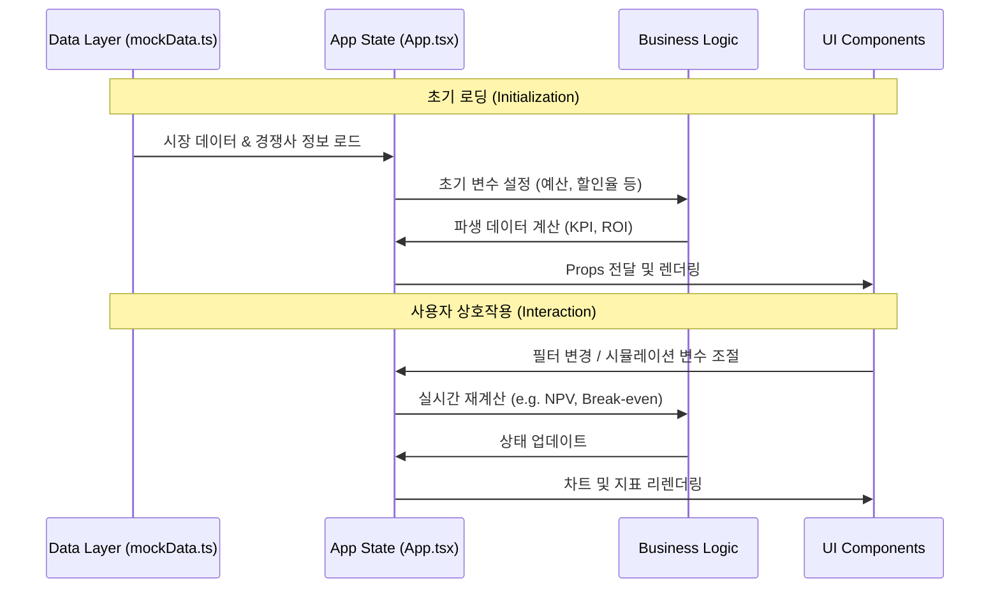

# ESG Carbon Dashboard - 완전 상세 설계 문서

> **이 문서는 코드 전체가 손실되더라도 README만으로 시스템을 완전히 재구축할 수 있도록 작성되었습니다.**

---

## 목차

1. [프로젝트 개요](#프로젝트-개요)
2. [기술 스택](#기술-스택)
3. [디렉토리 구조](#디렉토리-구조)
4. [백엔드 상세 설계](#백엔드-상세-설계)
5. [프론트엔드 상세 설계](#프론트엔드-상세-설계)
6. [API 명세](#api-명세)
7. [데이터 흐름도](#데이터-흐름도)
8. [환경 변수 설정](#환경-변수-설정)
9. [실행 방법](#실행-방법)
10. [확장 가이드](#확장-가이드)

---

## 프로젝트 개요

**ESG Carbon Dashboard**는 기업의 탄소 배출량을 시각화하고, 글로벌 탄소 시장(EU-ETS, K-ETS) 동향을 분석하며, AI 기반 탄소 배출권 매수 전략을 제안하는 웹 애플리케이션입니다.

### 핵심 기능

| 기능 | 설명 |
|------|------|
| **대시보드 (Dashboard)** | 기업별 Scope 1/2/3 배출량, 탄소 집약도, 배출권 사용률 시각화 |
| **경쟁사 비교 (Compare)** | 동종 업계 경쟁사와의 배출량 벤치마킹 |
| **시뮬레이터 (Simulator)** | 글로벌 탄소 가격 동향 차트, 분할 매수 플래너, WTI 유가 연동 |
| **목표 관리 (Target)** | SBTi 기반 감축 경로 추적 및 AI 진단 |
| **투자 분석 (Investment)** | 녹색 투자 NPV, ROI, 손익분기점 분석 |
| **AI 챗봇 (ChatBot)** | ESG 관련 질의응답, Text-to-SQL 쿼리 생성 |

---

## 🏗️ 시스템 아키텍처 및 구조도 (System Architecture)

이 애플리케이션은 **컴포넌트 기반 아키텍처**를 따르며, 최상위 `App` 컴포넌트가 전역 상태를 관리하고 하위 탭 컴포넌트에 데이터를 분배하는 중앙 집중식 구조를 가집니다.

### 1. 컴포넌트 계층 구조 (Component Hierarchy)

```mermaid
graph TD
    App[App.tsx (Main Container)]
    
    subgraph Layout
        Header[Header.tsx]
    end
    
    subgraph Features / Tabs
        Dash[DashboardTab]
        Comp[CompareTab]
        Sim[SimulatorTab]
        Tgt[TargetTab]
        Inv[InvestmentTab]
    end
    
    subgraph Shared UI (Design System)
        Card[Card.tsx]
        Btn[Button.tsx]
        Badge[Badge.tsx]
        Tooltip[CustomTooltip.tsx]
    end

    subgraph Chat Agent
        Chat[ChatBot.tsx]
    end

    App --> Header
    App --> Dash
    App --> Comp
    App --> Sim
    App --> Tgt
    App --> Inv
    App --> Chat
    
    Dash --> Card & Btn & Badge & Tooltip
    Comp --> Card & Btn & Badge & Tooltip
    Sim --> Card & Btn & Badge & Tooltip
    Tgt --> Card & Btn & Badge & Tooltip
    Inv --> Card & Btn & Badge & Tooltip
```

### 2. 데이터 흐름 파이프라인 (Data Pipeline)

애플리케이션 내 데이터는 정적 데이터(Mock Data)에서 시작하여 상태(State)로 가공된 후, 각 뷰(View)로 전달됩니다.



---

## 🌟 핵심 기능 및 모듈 (Core Modules)

| 모듈명 | 파일 위치 | 설명 | 주요 데이터 |
|:---:|:---:|:---|:---|
| **대시보드** | `tabs/DashboardTab.tsx` | 전체 배출 현황 및 KPI 요약 | 총 배출량, Scope 비중, 리스크 금액 |
| **비교 분석** | `tabs/CompareTab.tsx` | 경쟁사 벤치마킹 및 랭킹 | 탄소 집약도(매출/생산), 업계 평균 |
| **시뮬레이터** | `tabs/SimulatorTab.tsx` | 배출권 가격 예측 및 매수 전략 | ETS 시세, 스마트 분할 매수(Tranche) |
| **목표 관리** | `tabs/TargetTab.tsx` | Net Zero 감축 경로 이행 점검 | SBTi 1.5°C 시나리오, 감축 실적 |
| **투자 전략** | `tabs/InvestmentTab.tsx` | 녹색 투자 ROI 및 손익분기점 분석 | NPV, ROI, Payback Period, 탄소세 |
| **AI 챗봇** | `ChatBot.tsx` | 전략 제안 및 질의응답 에이전트 | 채팅 내역, 자동 응답 로직 |

---

## 기술 스택

### 백엔드

| 카테고리 | 기술 | 버전 | 용도 |
|----------|------|------|------|
| **프레임워크** | FastAPI | latest | REST API 서버 |
| **서버** | Uvicorn | latest | ASGI 서버 |
| **ORM** | SQLAlchemy | latest | 데이터베이스 연동 |
| **데이터베이스** | SQLite | - | 로컬 데이터 저장 |
| **데이터 수집** | yfinance | latest | 주가/탄소가격 수집 |
| **데이터 수집** | yahoo_fin | latest | yfinance 백업 (웹 스크래핑) |
| **데이터 수집** | FinanceDataReader | latest | 한국 주식/KRX 데이터 |
| **HTTP 클라이언트** | httpx | latest | 외부 API 호출 |
| **데이터 처리** | pandas, numpy | latest | 데이터 분석 |
| **설정 관리** | pydantic-settings | latest | 환경변수 관리 |

### 프론트엔드

| 카테고리 | 기술 | 버전 | 용도 |
|----------|------|------|------|
| **프레임워크** | React | 19.2.0 | UI 라이브러리 |
| **빌드 도구** | Vite | 7.3.1 | 개발 서버 및 빌드 |
| **언어** | TypeScript | 5.9.3 | 타입 안전성 |
| **스타일링** | TailwindCSS | 4.1.18 | 유틸리티 기반 CSS |
| **차트** | Recharts | 3.7.0 | 데이터 시각화 |
| **아이콘** | Lucide React | 0.562.0 | 아이콘 라이브러리 |
| **스타일 유틸** | class-variance-authority | 0.7.1 | 컴포넌트 variant 관리 |
| **스타일 유틸** | clsx, tailwind-merge | latest | 조건부 클래스명 |

---

## 디렉토리 구조

```
ESG_Wep/
├── backend/                          # 백엔드 (FastAPI)
│   ├── .env                          # 환경 변수 (API 키)
│   ├── requirements.txt              # Python 의존성
│   └── app/
│       ├── __init__.py
│       ├── main.py                   # FastAPI 앱 진입점
│       ├── config.py                 # 환경변수 설정 (Pydantic)
│       ├── database.py               # SQLAlchemy 엔진/세션
│       ├── routers/                  # API 라우터  
│       │   ├── __init__.py
│       │   ├── simulator.py          # /api/v1/sim/* 엔드포인트
│       │   └── ai.py                 # /api/v1/ai/* 엔드포인트
│       └── services/                 # 비즈니스 로직
│           ├── __init__.py
│           ├── market_data.py        # 탄소 시장 데이터 수집
│           ├── oil_price.py          # 유가 API 연동
│           ├── ai_service.py         # AI 전략/채팅/Text-to-SQL
│           └── eex_scraper.py        # EEX 경매 데이터 스크래퍼 (미완)
│
├── frontend/                         # 프론트엔드 (React + Vite)
│   ├── package.json                  # npm 의존성
│   ├── vite.config.ts                # Vite 설정
│   ├── tsconfig.json                 # TypeScript 설정
│   ├── index.html                    # HTML 진입점
│   └── src/
│       ├── main.tsx                  # React 진입점
│       ├── App.tsx                   # 메인 앱 컴포넌트 (상태 관리)
│       ├── App.css                   # 전역 스타일
│       ├── index.css                 # TailwindCSS 진입점 (버전 4)
│       ├── features/                 # 기능별 모듈화 (Refactored)
│       │   ├── 대시보드/             # Dashboard 관련
│       │   │   └── DashboardTab.tsx
│       │   ├── 경쟁사비교/           # Compare 관련
│       │   │   └── CompareTab.tsx
│       │   ├── 시뮬레이터/           # Simulator 관련
│       │   │   └── SimulatorTab.tsx
│       │   ├── 목표설정/             # Target 관련
│       │   │   └── TargetTab.tsx
│       │   └── 투자계획/             # Investment 관련
│       │       └── InvestmentTab.tsx
│       ├── components/               # 공공 UI 컴포넌트
│       │   ├── ChatBot.tsx           # AI 채팅 UI
│       │   ├── layout/
│       │   │   └── Header.tsx        # 네비게이션 헤더 (탭/기업 선택)
│       │   └── ui/                   # 원자 단위 UI 컴포넌트
│       │       ├── Card.tsx          # 카드 컴포넌트
│       │       ├── Button.tsx        # 버튼 컴포넌트
│       │       ├── Badge.tsx         # 배지 컴포넌트
│       │       ├── Dropdown.tsx      # 드롭다운 컴포넌트
│       │       ├── CustomTooltip.tsx # 차트 툴팁 컴포넌트
│       │       └── utils.ts          # cn(), formatKRW() 유틸리티
│       ├── types/
│       │   └── index.ts              # 전역 TypeScript 타입 정의
│       ├── data/
│       │   └── mockData.ts           # 초기/폴백 Mock 데이터
│       ├── lib/
│       │   └── utils.ts              # 공통 유틸리티
│       └── assets/                   # 이미지 및 정적 자원
│
└── README.md                         # 이 문서
```

---

## 백엔드 상세 설계

### 1. main.py (FastAPI 앱 진입점)

```python
from fastapi import FastAPI
from fastapi.middleware.cors import CORSMiddleware
from .routers import simulator, ai
from .services.market_data import market_service
import asyncio

app = FastAPI(title="ESG Simulator API")

# CORS 설정 (React 프론트엔드 연결 허용)
app.add_middleware(
    CORSMiddleware,
    allow_origins=["*"],
    allow_credentials=True,
    allow_methods=["*"],
    allow_headers=["*"],
)

app.include_router(simulator.router)
app.include_router(ai.router)

# 서버 시작 시 데이터 미리 로딩 (Preload)
@app.on_event("startup")
async def startup_event():
    asyncio.create_task(market_service.preload_data())

@app.get("/")
async def root():
    return {"message": "ESG Simulator API is running"}
```

**설계 의도:**

- CORS 미들웨어로 `localhost:5173` (프론트엔드)에서의 요청 허용
- `@app.on_event("startup")`에서 시장 데이터 3년치를 비동기로 미리 로딩하여 API 응답 속도 최적화
- 라우터 분리: `simulator.router`로 시뮬레이션 관련, `ai.router`로 AI 관련 기능 분리

---

### 2. config.py (환경 변수 관리)

```python
from pydantic_settings import BaseSettings

class Settings(BaseSettings):
    KRX_API_KEY: str
    ALPHA_VANTAGE_API_KEY: str
    OIL_PRICE_API_KEY: str

    class Config:
        env_file = ".env"

settings = Settings()
```

**설계 의도:**

- `pydantic-settings`를 사용하여 `.env` 파일에서 환경 변수 자동 로드
- 타입 검증 및 누락 시 명확한 에러 메시지 제공

---

### 3. database.py (SQLAlchemy 설정)

```python
from sqlalchemy import create_engine
from sqlalchemy.orm import sessionmaker, declarative_base

# 로컬 SQLite 데이터베이스
SQLALCHEMY_DATABASE_URL = "sqlite:///./esg_data.db"

engine = create_engine(
    SQLALCHEMY_DATABASE_URL, connect_args={"check_same_thread": False}
)
SessionLocal = sessionmaker(autocommit=False, autoflush=False, bind=engine)

Base = declarative_base()
```

**설계 의도:**

- SQLite 사용으로 별도 DB 서버 없이 로컬 파일 기반 데이터 저장
- `check_same_thread=False`로 FastAPI의 비동기 환경에서 SQLite 사용 가능

---

### 4. routers/simulator.py (시뮬레이션 API)

**엔드포인트 목록:**

| 메서드 | 경로 | 설명 |
|--------|------|------|
| GET | `/api/v1/sim/dashboard/trend-combined` | 대시보드 리스크 시뮬레이션 |
| GET | `/api/v1/sim/dashboard/market-trends` | 글로벌 탄소 가격 동향 |
| GET | `/api/v1/sim/market/oil-prices` | 실시간 WTI/Brent 유가 |

**핵심 로직:**

```python
router = APIRouter(prefix="/api/v1/sim", tags=["simulator"])

@router.get("/dashboard/market-trends")
async def get_market_trends(period: str = "1y"):
    """
    period: "1m" | "3m" | "1y" | "all"
    반환: { "period": str, "chart_data": [...] }
    chart_data 각 항목: { "date": "YYYY-MM-DD", "euPrice": float, "krPrice": int }
    """
    chart_data = await market_service.get_dual_market_history(period)
    return {"period": period, "chart_data": chart_data}

@router.get("/market/oil-prices")
async def get_oil_prices():
    """
    반환: { "price": float, "currency": "USD", "commodity": "crude_oil", ... }
    """
    return await oil_price_service.get_latest_prices()
```

---

### 5. routers/ai.py (AI API)

**엔드포인트 목록:**

| 메서드 | 경로 | 설명 |
|--------|------|------|
| POST | `/api/v1/ai/strategy` | AI 매수 전략 생성 |
| POST | `/api/v1/ai/chat` | AI 챗봇 대화 |
| POST | `/api/v1/ai/text-to-sql` | 자연어 → SQL 변환 |

**요청/응답 스키마:**

```python
class StrategyRequest(BaseModel):
    companyId: int
    market: str        # "K-ETS" | "EU-ETS"
    currentPrice: float

class ChatRequest(BaseModel):
    message: str

class SQLRequest(BaseModel):
    question: str
    db_schema: str     # 데이터베이스 스키마 정보
```

**응답 예시:**

```json
// POST /api/v1/ai/strategy
{
    "strategy_text": "⚠️ [고변동성 감지] K-ETS 시장의 변동성이 높습니다...",
    "tranches": [
        { "id": 1707000001, "market": "K-ETS", "price": 15230, "month": "26.02", "isFuture": true, "percentage": 30 },
        { "id": 1707000002, "market": "K-ETS", "price": 15100, "month": "26.04", "isFuture": true, "percentage": 40 },
        { "id": 1707000003, "market": "K-ETS", "price": 14950, "month": "26.06", "isFuture": true, "percentage": 30 }
    ],
    "analysis_date": "2026-02-04 10:30"
}

// POST /api/v1/ai/text-to-sql
{
    "question": "삼성전자의 ESG 점수 조회해줘",
    "generated_sql": "SELECT * FROM documents WHERE content LIKE '%삼성전자%' LIMIT 10;"
}
```

---

### 6. services/market_data.py (시장 데이터 서비스)

**핵심 설계 - 3중 데이터 백업 시스템:**

```
EU-ETS 데이터:
  [Try 0] Alpha Vantage API (FCO2.FRK)
    ↓ 실패 시
  [Try 1] yfinance (FCO2.DE)
    ↓ 실패 시
  [Try 2] yahoo_fin 웹 스크래핑 (FCO2.DE)
    ↓ 모두 실패 시
  [Fallback] Mock 데이터 생성 (평균 €72 기준 랜덤)

K-ETS 데이터:
  [Try 1] FinanceDataReader (KAU 동적 탐색)
    ↓ 실패 시
  [Try 2] yfinance (400590.KS KODEX ETF)
    ↓ 실패 시
  [Try 3] yahoo_fin (400590.KS)
    ↓ 모두 실패 시
  [Fallback] Mock 데이터 생성 (평균 ₩15,500 기준 랜덤)
```

**인메모리 캐싱 전략:**

```python
class MarketDataService:
    _cache = []           # 클래스 레벨 캐시 (모든 요청 공유)
    _last_updated = None  # 마지막 갱신 시각
    _is_updating = False  # 갱신 중 플래그 (중복 방지)

    async def preload_data(self):
        """서버 시작 시 3년치 데이터 미리 로딩"""
        data = await asyncio.to_thread(self._fetch_dual_market_data, days=1095)
        MarketDataService._cache = data
        MarketDataService._last_updated = datetime.now()

    async def get_dual_market_history(self, period: str = "1y"):
        """캐시 우선 반환, 30분 경과 시 백그라운드 갱신"""
        if not MarketDataService._cache:
            await self.preload_data()
        
        time_diff = datetime.now() - MarketDataService._last_updated
        if time_diff > timedelta(minutes=30) and not MarketDataService._is_updating:
            MarketDataService._is_updating = True
            asyncio.create_task(self._refresh_cache())
        
        days_map = {"1m": 30, "3m": 90, "1y": 365, "all": 1095}
        req_days = days_map.get(period, 365)
        return MarketDataService._cache[-req_days:]
```

**반환 데이터 형식:**

```json
[
    { "date": "2023-01-02", "euPrice": 72.35, "krPrice": 15420 },
    { "date": "2023-01-03", "euPrice": 73.10, "krPrice": 15380 },
    ...
]
```

---

### 7. services/oil_price.py (유가 서비스)

```python
class OilPriceService:
    def __init__(self):
        self.api_key = settings.OIL_PRICE_API_KEY
        self.base_url = "https://api.oilpriceapi.com/v1"
        self.headers = {
            "Authorization": f"Token {self.api_key}",
            "Content-Type": "application/json"
        }

    async def get_latest_prices(self):
        """
        반환: { "price": 75.42, "currency": "USD", "commodity": "crude_oil", "type": "brent", "unit": "barrel" }
        API 오류 시 Fallback 데이터 반환
        """
        try:
            async with httpx.AsyncClient() as client:
                response = await client.get(f"{self.base_url}/prices/latest", headers=self.headers)
                if response.status_code == 200:
                    return response.json().get("data", {})
                return self._get_fallback_data()
        except Exception:
            return self._get_fallback_data()

    def _get_fallback_data(self):
        return {"price": 75.42, "currency": "USD", "commodity": "crude_oil", "type": "brent", "unit": "barrel"}
```

---

### 8. services/eex_scraper.py (EEX 경매 데이터 스크래퍼)

> **참고**: 현재 Mock 구현 상태이며, 실제 EEX 사이트 구조에 맞춰 확장 필요

```python
import requests
import pandas as pd
from datetime import datetime

class EEXScraperService:
    def __init__(self):
        self.base_url = "https://www.eex.com/en/market-data/environmental-markets/auction-market"
        # EEX URL 패턴은 연도/월별로 다를 수 있으므로 정규화 필요

    def download_auction_data(self):
        """
        EEX 경매 데이터를 다운로드하고 파싱 (오전 11시 CET 이후 권장)
        """
        try:
            print("Fetching EEX data...")
            # 실제 구현 시:
            # response = requests.get(self.base_url)
            # soup = BeautifulSoup(response.text, 'html.parser')
            # ... 최신 데이터 링크 추출 ...
            
            # 현재 Mock 로직
            return {"status": "success", "message": "EEX data pipeline ready"}
        except Exception as e:
            return {"status": "error", "message": str(e)}

eex_scraper = EEXScraperService()
```

---

### 9. services/ai_service.py (AI 서비스)

**AI 전략 생성 로직:**

```python
async def generate_strategy(self, company_id: int, market: str, current_price: float):
    is_high_volatility = random.choice([True, False])
    
    # 3개의 분할 매수 시점 선택
    months = ["26.02", "26.03", "26.04", "26.05", "26.06", "26.07", "26.08", "26.09"]
    selected_months = random.sample(months, 3)
    selected_months.sort()

    # 변동성에 따른 전략 분배
    if is_high_volatility:
        strategy_text = "⚠️ [고변동성 감지] 리스크 분산을 위해 3회 분할 매수 전략 추천"
        percentages = [30, 40, 30]
    else:
        strategy_text = "✅ [안정적 추세] 저점 확보를 위한 공격적 매수 전략 유효"
        percentages = [50, 30, 20]

    tranches = []
    for i, month in enumerate(selected_months):
        forecast_price = current_price * (1 + random.uniform(-0.05, 0.05))
        tranches.append({
            "id": int(datetime.now().timestamp() * 1000) + i,
            "market": market,
            "price": round(forecast_price, 2) if market == "EU-ETS" else int(forecast_price),
            "month": month,
            "isFuture": True,
            "percentage": percentages[i]
        })

    return {"strategy_text": strategy_text, "tranches": tranches}
```

**Text-to-SQL 로직:**

```python
async def text_to_sql(self, question: str, db_schema: str = None):
    """
    GPU 환경: distil-labs/distil-qwen3-4b-text2sql 모델 사용
    CPU 환경: 규칙 기반 기본 쿼리 생성
    """
    try:
        import torch
        from transformers import AutoModelForCausalLM, AutoTokenizer
        # 실제 모델 로드 및 추론 (주석 해제 필요)
        return f"SELECT id, title, esg_score FROM documents WHERE content LIKE '%{question}%' ORDER BY esg_score DESC;"
    except ImportError:
        return f"SELECT * FROM documents WHERE content LIKE '%{question}%' LIMIT 10;"
```

---

## 프론트엔드 상세 설계

### 1. App.tsx (메인 앱 컴포넌트)

**상태 관리:**

```typescript
// 탭 상태
const [activeTab, setActiveTab] = useState<TabType>('dashboard');

// 시장 선택 상태
const [selectedMarket, setSelectedMarket] = useState<MarketType>('K-ETS');

// 시간 범위 상태
const [timeRange, setTimeRange] = useState<TimeRangeType>('1년');

// 시장 데이터 상태
const [fullHistoryData, setFullHistoryData] = useState<TrendData[]>([]);

// 분할 매수 전략 상태
const [activeTranches, setActiveTranches] = useState<Tranche[]>([]);

// 채팅 상태
const [chatMessages, setChatMessages] = useState<ChatMessage[]>([...]);
const [inputMessage, setInputMessage] = useState('');
const [isChatLoading, setIsChatLoading] = useState(false);
```

**API 호출 로직:**

```typescript
// 시장 데이터 Fetch (시간 범위 변경 시)
useEffect(() => {
    const fetchMarketData = async () => {
        const periodMap: Record<TimeRangeType, string> = {
            '1개월': '1m', '3개월': '3m', '1년': '1y', '전체': 'all'
        };
        const response = await fetch(`http://localhost:8000/api/v1/sim/dashboard/market-trends?period=${periodMap[timeRange]}`);
        const data = await response.json();
        if (data.chart_data) {
            setFullHistoryData(data.chart_data.map((item: any) => ({
                ...item,
                type: new Date(item.date) > new Date() ? 'forecast' : 'actual'
            })));
        }
    };
    fetchMarketData();
}, [timeRange]);
```

**AI 전략 생성:**

```typescript
const generateAIPlan = async () => {
    setIsChatLoading(true);
    const currentPrice = selectedMarket === 'K-ETS' ? MARKET_DATA['K-ETS'].price : MARKET_DATA['EU-ETS'].price;
    
    const response = await fetch('http://localhost:8000/api/v1/ai/strategy', {
        method: 'POST',
        headers: { 'Content-Type': 'application/json' },
        body: JSON.stringify({
            companyId: selectedCompId,
            market: selectedMarket,
            currentPrice: currentPrice
        })
    });
    
    const data = await response.json();
    if (data.tranches) {
        setActiveTranches(data.tranches);
    }
    setChatMessages(prev => [...prev, { role: 'assistant', text: data.strategy_text }]);
    setIsChatLoading(false);
};
```

**Text-to-SQL 채팅:**

```typescript
const handleSendMessage = async (e: React.FormEvent) => {
    e.preventDefault();
    const userText = inputMessage;
    setChatMessages(prev => [...prev, { role: 'user', text: userText }]);
    setIsChatLoading(true);

    // 'SQL' 또는 '쿼리' 키워드 감지 시 Text-to-SQL API 호출
    if (userText.toUpperCase().includes('SQL') || userText.includes('쿼리')) {
        const response = await fetch('http://localhost:8000/api/v1/ai/text-to-sql', {
            method: 'POST',
            headers: { 'Content-Type': 'application/json' },
            body: JSON.stringify({
                question: userText,
                db_schema: "documents(id, content, esg_score)"
            })
        });
        const data = await response.json();
        setChatMessages(prev => [...prev, {
            role: 'assistant',
            text: `생성된 SQL 쿼리입니다:\n\n\`\`\`sql\n${data.generated_sql}\n\`\`\``
        }]);
    } else {
        // 일반 채팅 API 호출
        const response = await fetch('http://localhost:8000/api/v1/ai/chat', {
            method: 'POST',
            headers: { 'Content-Type': 'application/json' },
            body: JSON.stringify({ message: userText })
        });
        const data = await response.json();
        setChatMessages(prev => [...prev, { role: 'assistant', text: data.response }]);
    }
    setIsChatLoading(false);
};
```

---

### 2. types/index.ts (TypeScript 타입 정의)

```typescript
// 탭 타입
export type TabType = 'dashboard' | 'compare' | 'simulator' | 'target' | 'investment';

// 시장 타입
export type MarketType = 'K-ETS' | 'EU-ETS';

// 시간 범위 타입
export type TimeRangeType = '1개월' | '3개월' | '1년' | '전체';

// 탄소 집약도 타입
export type IntensityType = 'revenue' | 'production';

// 감축 궤적 데이터
export interface TrajectoryData {
    year: string;
    v: number;
}

// 기업 설정 (시뮬레이션용)
export interface CompanyConfig {
    id: number;
    name: string;
    dartCode: string;
    baseEmissions: number;   // 기준 배출량 (tCO2)
    investCapex: number;     // 녹색 투자액 (원)
    targetSavings: number;   // 목표 절감률 (%)
    s1: number;              // Scope 1 배출량
    s2: number;              // Scope 2 배출량
    s3: number;              // Scope 3 배출량
    allowance: number;       // 무상 할당량
    revenue: number;         // 매출 (억원)
    production: number;      // 생산량 (단위)
}

// 경쟁사 데이터
export interface Competitor {
    id: number;
    name: string;
    s1: number;
    s2: number;
    s3: number;
    allowance: number;
    revenue: number;
    production: number;
    trustScore: number;              // ESG 신뢰도 점수
    trajectory: TrajectoryData[];    // 감축 궤적
    intensityValue?: number;
}

// 시장 동향 데이터 (차트용)
export interface TrendData {
    date: string;                    // "YYYY-MM-DD"
    type?: 'actual' | 'forecast';    // 과거/예측 구분
    krPrice?: number;                // K-ETS 가격 (원)
    euPrice?: number;                // EU-ETS 가격 (유로)
    month?: string;
}

// 분할 매수 시나리오
export interface Tranche {
    id: number;
    market: MarketType;
    price: number;
    month: string;                   // "26.02" 형식
    isFuture: boolean;               // 미래 예정 여부
    percentage: number;              // 배분 비율 (%)
}

// 시장 정보 (카드 표시용)
export interface MarketInfo {
    id: MarketType;
    name: string;
    ticker: string;
    price: number;
    currency: string;
    change: number;                  // 변동률 (%)
    color: string;
    desc: string;
    high: number;
    low: number;
    volatility: string;              // "High" | "Low"
}

// 채팅 메시지
export interface ChatMessage {
    role: string;                    // 'user' | 'assistant'
    text: string;
}
```

---

### 3. data/mockData.ts (Mock 데이터)

```typescript
import type { Competitor, MarketInfo, MarketType, CompanyConfig } from '../types';

export const MOCK_COMPANIES: CompanyConfig[] = [
    {
        id: 1,
        name: "현대건설",
        dartCode: "00126380",
        baseEmissions: 250684,
        investCapex: 762100000000,    // 7,621억원
        targetSavings: 12.5,
        s1: 75000, s2: 45000, s3: 130684, allowance: 100000, revenue: 5000, production: 1000000
    },
    {
        id: 2,
        name: "삼성물산",
        dartCode: "000830",
        baseEmissions: 180000,
        investCapex: 500000000000,    // 5,000억원
        targetSavings: 15.0,
        s1: 50000, s2: 40000, s3: 90000, allowance: 80000, revenue: 4200, production: 800000
    }
];

export const MARKET_DATA: Record<MarketType, MarketInfo> = {
    'K-ETS': {
        id: 'K-ETS',
        name: '한국',
        ticker: 'KAU25',
        price: 15450,
        currency: 'KRW',
        change: 1.2,
        color: '#10b77f',
        desc: 'KAU25 할당배출권',
        high: 16500,
        low: 13800,
        volatility: 'Low'
    },
    'EU-ETS': {
        id: 'EU-ETS',
        name: '유럽 통합',
        ticker: 'EUA',
        price: 74.50,
        currency: 'EUR',
        change: -0.5,
        color: '#a5d8ff',
        desc: '글로벌 벤치마크',
        high: 76.20,
        low: 72.80,
        volatility: 'High'
    },
};

export const competitors: Competitor[] = [
    { id: 1, name: "우리 기업", s1: 75000, s2: 45000, s3: 120000, allowance: 100000, revenue: 5000, production: 1000000, trustScore: 95, trajectory: [...] },
    { id: 2, name: "A사 (Top)", s1: 45000, s2: 40000, s3: 85000, allowance: 95000, revenue: 4800, production: 1200000, trustScore: 88, trajectory: [...] },
    { id: 3, name: "B사 (Peer)", s1: 95000, s2: 65000, s3: 150000, allowance: 110000, revenue: 5200, production: 900000, trustScore: 62, trajectory: [...] },
];

export const industryBenchmarks = {
    revenue: { top10: 15.2, median: 22.5 },
    production: { top10: 65.0, median: 92.4 }
};
```

---

### 4. components/ui (UI 컴포넌트 라이브러리)

#### Card.tsx

```typescript
import { cva, type VariantProps } from 'class-variance-authority';
import { cn } from './utils';

const cardVariants = cva(
    "rounded-[24px] border border-slate-100 shadow-sm bg-white overflow-hidden transition-all relative group hover:shadow-md duration-300",
    {
        variants: {
            variant: {
                default: "bg-white",
                dark: "bg-[#10221c] text-white border-[#1a2e28]",
                blue: "bg-[#615CEB] text-white border-[#615CEB] shadow-blue-500/20",
                hoverable: "hover:scale-[1.02] cursor-pointer border-transparent hover:border-[#10b77f]/30",
                active: "ring-2 ring-[#10b77f] border-[#10b77f] shadow-lg scale-[1.02]",
                inactive: "opacity-60 grayscale-[0.5] hover:opacity-100 hover:grayscale-0 cursor-pointer border-dashed bg-slate-50",
            },
            padding: {
                none: "p-0",
                sm: "p-4",
                default: "p-6",
                lg: "p-8",
            }
        },
        defaultVariants: {
            variant: "default",
            padding: "default",
        }
    }
);

interface CardProps extends HTMLAttributes<HTMLDivElement>, VariantProps<typeof cardVariants> {}

export const Card = ({ className, variant, padding, ...props }: CardProps) => (
    <div className={cn(cardVariants({ variant, padding, className }))} {...props} />
);
```

#### utils.ts

```typescript
import { clsx, type ClassValue } from 'clsx';
import { twMerge } from 'tailwind-merge';

// Tailwind 클래스 머지 유틸리티
export function cn(...inputs: ClassValue[]) {
    return twMerge(clsx(inputs));
}

// 원화 포맷 (억원)
export const formatKRW = (value: number) => {
    return (value / 100000000).toFixed(1) + "억원";
};

// 억 단위 포맷
export const formatBillions = (value: number) => {
    return (value / 100000000).toFixed(0) + "억 원";
};
```

#### CustomTooltip.tsx (Recharts 차트 툴팁)

```typescript
export const CustomTooltip = ({ active, payload, label, unit }: any) => {
    if (active && payload && payload.length) {
        return (
            <div className="bg-white/95 backdrop-blur-md border border-slate-100 p-4 rounded-xl shadow-2xl text-xs z-50">
                <p className="font-bold text-slate-800 mb-2 border-b border-slate-100 pb-2">{label}</p>
                {payload.map((entry: any, index: number) => {
                    const isCurrency = ['K-ETS', 'EU-ETS', 'UK-ETS', 'Cost', 'Price'].some(key => entry.name?.includes(key));
                    const currencySymbol = entry.name?.includes('EU') ? '€' : (entry.name?.includes('UK') ? '£' : '₩');
                    return (
                        <div key={index} className="flex items-center gap-2 mb-1 justify-between min-w-[120px]">
                            <div className="flex items-center gap-2">
                                <div className="w-2 h-2 rounded-full" style={{ backgroundColor: entry.color }} />
                                <span className="text-slate-500 font-medium capitalize">{entry.name}</span>
                            </div>
                            <span className="font-bold text-slate-900 font-mono">
                                {isCurrency && !unit ? currencySymbol : ''}
                                {typeof entry.value === 'number' ? entry.value.toLocaleString() : entry.value}
                                {unit ? ` ${unit}` : ''}
                            </span>
                        </div>
                    );
                })}
            </div>
        );
    }
    return null;
};
```

#### Button.tsx

```typescript
import { cva, type VariantProps } from 'class-variance-authority';
import { cn } from './utils';

const buttonVariants = cva(
    "inline-flex items-center justify-center rounded-xl text-xs font-bold transition-all focus-visible:outline-none focus-visible:ring-2 focus-visible:ring-[#10b77f] disabled:pointer-events-none disabled:opacity-50",
    {
        variants: {
            variant: {
                default: "bg-[#10b77f] hover:bg-[#0e9f6e] text-white shadow-lg shadow-[#10b77f]/20",
                destructive: "text-slate-400 hover:text-red-500 hover:bg-red-50",
                outline: "border border-slate-200 bg-white hover:bg-slate-50 text-slate-700",
                secondary: "bg-slate-100 text-slate-900 hover:bg-slate-200",
                ghost: "hover:bg-slate-100 hover:text-slate-900 text-slate-500",
                tab: "text-slate-400 hover:text-slate-700 font-medium",
                tabActive: "bg-white text-[#10b77f] shadow-sm ring-1 ring-slate-100 font-bold",
                marketK: "text-slate-500 hover:bg-emerald-50 hover:text-[#10b77f]",
                marketKActive: "bg-[#10b77f]/10 text-[#10b77f] ring-1 ring-[#10b77f]/30",
                marketEU: "text-slate-500 hover:bg-blue-50 hover:text-blue-600",
                marketEUActive: "bg-blue-50 text-blue-600 ring-1 ring-blue-200",
            },
            size: {
                default: "h-10 px-4 py-2",
                sm: "h-8 rounded-lg px-3",
                xs: "h-7 rounded-lg px-2 text-[10px]",
                lg: "h-12 rounded-2xl px-8",
                icon: "h-10 w-10",
            },
        },
        defaultVariants: { variant: "default", size: "default" },
    }
);

export const Button = ({ className, variant, size, ...props }: ButtonProps) => (
    <button className={cn(buttonVariants({ variant, size, className }))} {...props} />
);
```

#### Badge.tsx

```typescript
import { cva, type VariantProps } from 'class-variance-authority';
import { cn } from './utils';

const badgeVariants = cva(
    "inline-flex items-center rounded-full px-2.5 py-1 text-[10px] font-bold uppercase ring-1 ring-inset tracking-wide",
    {
        variants: {
            variant: {
                default: "bg-slate-50 text-slate-600 ring-slate-200",
                success: "bg-[#e7fdf0] text-[#0e9f6e] ring-[#0e9f6e]/20",
                warning: "bg-orange-50 text-orange-700 ring-orange-600/20",
                blue: "bg-blue-50 text-blue-700 ring-blue-700/10",
                purple: "bg-purple-50 text-purple-700 ring-purple-700/10",
                amber: "bg-amber-50 text-amber-700 ring-amber-700/10",
                top: "bg-blue-500 text-white ring-blue-500 shadow-sm shadow-blue-200",
                me: "bg-slate-800 text-white ring-slate-800 shadow-sm",
            },
        },
        defaultVariants: { variant: "default" },
    }
);

export const Badge = ({ className, variant, ...props }: BadgeProps) => (
    <span className={cn(badgeVariants({ variant, className }))} {...props} />
);
```

#### Dropdown.tsx

```typescript
import React, { useRef } from 'react';
import { cn } from './utils';

interface DropdownProps {
    isOpen: boolean;
    onClose: () => void;
    trigger: React.ReactNode;
    children: React.ReactNode;
    align?: 'left' | 'right';
    width?: string;
    className?: string;
}

export const Dropdown: React.FC<DropdownProps> = ({
    isOpen, onClose, trigger, children, align = 'left', width = 'w-56', className
}) => {
    const containerRef = useRef<HTMLDivElement>(null);

    return (
        <div className={cn("relative", className)} ref={containerRef}>
            {trigger}
            {isOpen && (
                <>
                    <div className="fixed inset-0 z-40" onClick={onClose} />
                    <div className={cn(
                        "absolute top-full mt-2 bg-white/95 backdrop-blur-sm rounded-2xl shadow-xl border border-slate-100 overflow-hidden z-50 animate-in fade-in zoom-in-95 duration-200",
                        width, align === 'right' ? 'right-0' : 'left-0'
                    )}>
                        {children}
                    </div>
                </>
            )}
        </div>
    );
};
```

#### Header.tsx (네비게이션 헤더)

```typescript
import React, { useState } from 'react';
import { Leaf, Building2, ChevronDown, Check } from 'lucide-react';
import { Button } from '../ui/Button';
import { Dropdown } from '../ui/Dropdown';
import { cn } from '../ui/utils';
import type { TabType, CompanyConfig } from '../../types';

interface HeaderProps {
    activeTab: TabType;
    setActiveTab: (tab: TabType) => void;
    tabs: { id: TabType; label: string }[];
    selectedCompany: CompanyConfig;
    setSelectedCompanyId: (id: number) => void;
    companies: CompanyConfig[];
}

export const Header: React.FC<HeaderProps> = ({
    activeTab, setActiveTab, tabs, selectedCompany, setSelectedCompanyId, companies
}) => {
    const [isCompanyMenuOpen, setIsCompanyMenuOpen] = useState(false);
    const [isTabMenuOpen, setIsTabMenuOpen] = useState(false);

    return (
        <nav className="bg-white/80 backdrop-blur-md border-b border-slate-100 px-8 py-4 flex justify-between items-center sticky top-0 z-30">
            <div className="flex items-center gap-8">
                {/* Brand & Company Selector Pill */}
                <div className="flex items-center bg-slate-100/50 rounded-2xl p-1.5 border border-slate-200/50">
                    <div className="flex items-center gap-2 px-3 py-1.5">
                        <div className="text-[#10b77f]"><Leaf size={20} /></div>
                        <span className="text-lg font-bold tracking-tight text-slate-800">ESG OS</span>
                    </div>
                    <div className="w-px h-5 bg-slate-300 mx-1"></div>
                    <Dropdown
                        isOpen={isCompanyMenuOpen}
                        onClose={() => setIsCompanyMenuOpen(false)}
                        align="left" width="w-56"
                        trigger={
                            <button onClick={() => setIsCompanyMenuOpen(!isCompanyMenuOpen)}
                                className="flex items-center gap-2 text-slate-700 font-bold text-lg hover:text-[#10b77f] transition-colors px-3 py-1.5 rounded-xl hover:bg-white hover:shadow-sm">
                                <span className="relative flex h-2.5 w-2.5">
                                    <span className="animate-ping absolute inline-flex h-full w-full rounded-full bg-[#10b77f] opacity-75"></span>
                                    <span className="relative inline-flex rounded-full h-2.5 w-2.5 bg-[#10b77f]"></span>
                                </span>
                                <span>{selectedCompany.name}</span>
                                <ChevronDown size={16} className={cn("transition-transform duration-200 text-slate-400", isCompanyMenuOpen ? "rotate-180" : "")} />
                            </button>
                        }
                    >
                        <div className="p-1.5 space-y-0.5">
                            <div className="px-3 py-2 text-[10px] font-bold text-slate-400 uppercase tracking-wider">Select Company</div>
                            {companies.map(comp => (
                                <button key={comp.id}
                                    onClick={() => { setSelectedCompanyId(comp.id); setIsCompanyMenuOpen(false); }}
                                    className={cn(
                                        "w-full text-left px-3 py-2.5 rounded-xl text-base font-medium transition-all flex items-center justify-between",
                                        selectedCompany.id === comp.id ? "bg-[#10b77f]/10 text-[#10b77f]" : "text-slate-600 hover:bg-slate-50"
                                    )}>
                                    <span className="flex items-center gap-2">
                                        <Building2 size={18} className={selectedCompany.id === comp.id ? "text-[#10b77f]" : "text-slate-400"} />
                                        {comp.name}
                                    </span>
                                    {selectedCompany.id === comp.id && <Check size={16} className="text-[#10b77f]" />}
                                </button>
                            ))}
                        </div>
                    </Dropdown>
                </div>
            </div>

            {/* Tab Navigation Dropdown */}
            <Dropdown isOpen={isTabMenuOpen} onClose={() => setIsTabMenuOpen(false)} align="right" width="w-48"
                trigger={
                    <button onClick={() => setIsTabMenuOpen(!isTabMenuOpen)}
                        className="flex items-center gap-3 bg-slate-100 hover:bg-slate-200/50 px-5 py-2.5 rounded-full transition-all">
                        <span className="text-base font-bold text-slate-800">{tabs.find(t => t.id === activeTab)?.label}</span>
                        <ChevronDown size={18} className={cn("text-slate-400 transition-transform duration-200", isTabMenuOpen ? "rotate-180" : "")} />
                    </button>
                }>
                <div className="p-1.5 space-y-0.5">
                    <div className="px-3 py-2 text-[10px] font-bold text-slate-400 uppercase tracking-wider">Navigate To</div>
                    {tabs.map(t => (
                        <button key={t.id}
                            onClick={() => { setActiveTab(t.id); setIsTabMenuOpen(false); }}
                            className={cn(
                                "w-full text-right px-4 py-2.5 rounded-xl text-base font-medium transition-all block hover:bg-slate-50",
                                activeTab === t.id ? "text-[#10b77f] bg-[#10b77f]/5" : "text-slate-600"
                            )}>
                            {t.label}
                        </button>
                    ))}
                </div>
            </Dropdown>
        </nav>
    );
};
```

---

### 5. components/tabs/SimulatorTab.tsx (시뮬레이터 탭)

**Props 인터페이스:**

```typescript
interface SimulatorTabProps {
    selectedMarket: MarketType;
    setSelectedMarket: (market: MarketType) => void;
    timeRange: TimeRangeType;
    setTimeRange: (range: TimeRangeType) => void;
    trendData: TrendData[];                    // 차트 데이터
    handleChartClick: (data: any) => void;     // 차트 클릭 핸들러
    activeTranches: Tranche[];                 // 분할 매수 목록
    totalExposure: number;                     // 총 노출량
    simBudget: number;                         // 예산 집행률 (0-100)
    setSimBudget: (budget: number) => void;
    simRisk: number;                           // 리스크 선호도 (0-100)
    setSimRisk: (risk: number) => void;
    budgetInWon: number;                       // 예산 (원)
    estimatedSavings: number;                  // 예상 절감액 (원)
    generateAIPlan: () => void;                // AI 전략 생성 함수
}
```

**핵심 차트 구성:**

```typescript
<ComposedChart data={trendData} onClick={handleChartClick}>
    <CartesianGrid strokeDasharray="3 3" vertical={false} stroke="#f1f5f9" />
    <XAxis
        dataKey="date"
        tickFormatter={(value) => {
            const d = new Date(value);
            if (timeRange === '전체' || timeRange === '1년') return `${d.getFullYear()}.${d.getMonth() + 1}`;
            return `${d.getMonth() + 1}.${d.getDate()}`;
        }}
    />
    <YAxis yAxisId="left" label={{ value: 'EUR', angle: -90 }} />
    <YAxis yAxisId="right" orientation="right" label={{ value: 'KRW', angle: 90 }} />
    <Tooltip content={<CustomTooltip />} />
    
    <Line yAxisId="left" dataKey="euPrice" stroke="#3b82f6" strokeWidth={selectedMarket === 'EU-ETS' ? 2.4 : 1.2} />
    <Line yAxisId="right" dataKey="krPrice" stroke="#10b77f" strokeWidth={selectedMarket === 'K-ETS' ? 2.4 : 1.2} />
</ComposedChart>
```

---

### 6. components/ChatBot.tsx (AI 챗봇 컴포넌트)

**Props 인터페이스:**

```typescript
interface ChatBotProps {
    isChatOpen: boolean;
    setIsChatOpen: (open: boolean) => void;
    chatMessages: ChatMessage[];
    inputMessage: string;
    setInputMessage: (msg: string) => void;
    handleSendMessage: (e: React.FormEvent) => void;
    chatEndRef: React.RefObject<HTMLDivElement | null>;
    isLoading?: boolean;
}
```

**UI 구조:**

```
+---------------------------------------+
| [Icon] Strategic AI Agent        [X] |  <- 헤더
+---------------------------------------+
|                                       |
|  [User Message Bubble]                |  <- 메시지 영역
|                 [Bot Message Bubble]  |
|  ...                                  |
|                                       |
+---------------------------------------+
| [Input Field] [Send Button]           |  <- 입력 영역
+---------------------------------------+
```

---

## API 명세

### 시뮬레이션 API (/api/v1/sim)

| 엔드포인트 | 메서드 | 파라미터 | 응답 |
|-----------|--------|----------|------|
| `/dashboard/market-trends` | GET | `period: "1m" \| "3m" \| "1y" \| "all"` | `{ "period": str, "chart_data": [{ "date": str, "euPrice": float, "krPrice": int }] }` |
| `/dashboard/trend-combined` | GET | `company: str, period: str, start_year: int, end_year: int` | `{ "mode": str, "period": str, "chart_data": [...] }` |
| `/market/oil-prices` | GET | - | `{ "price": float, "currency": str, "commodity": str, "type": str }` |

### AI API (/api/v1/ai)

| 엔드포인트 | 메서드 | 요청 바디 | 응답 |
|-----------|--------|----------|------|
| `/strategy` | POST | `{ "companyId": int, "market": str, "currentPrice": float }` | `{ "strategy_text": str, "tranches": [...], "analysis_date": str }` |
| `/chat` | POST | `{ "message": str }` | `{ "response": str }` |
| `/text-to-sql` | POST | `{ "question": str, "db_schema": str }` | `{ "question": str, "generated_sql": str }` |

---

## 데이터 흐름도

```
┌─────────────────────────────────────────────────────────────────┐
│                         프론트엔드 (React)                        │
│  ┌─────────┐   ┌─────────┐   ┌─────────┐   ┌─────────┐          │
│  │Dashboard│   │ Compare │   │Simulator│   │ Target  │ ...      │
│  └────┬────┘   └────┬────┘   └────┬────┘   └────┬────┘          │
│       │             │             │             │                │
│       └─────────────┴──────┬──────┴─────────────┘                │
│                            │                                     │
│                     ┌──────▼──────┐                              │
│                     │   App.tsx   │  (상태 관리 중앙집중)          │
│                     │  - useState │                              │
│                     │  - useMemo  │                              │
│                     │  - useEffect│                              │
│                     └──────┬──────┘                              │
└────────────────────────────┼────────────────────────────────────┘
                             │ fetch()
                             ▼
┌────────────────────────────────────────────────────────────────┐
│                      백엔드 (FastAPI)                            │
│                                                                 │
│  ┌─────────────────┐       ┌─────────────────┐                  │
│  │  simulator.py   │       │     ai.py       │                  │
│  │ /api/v1/sim/*   │       │ /api/v1/ai/*    │                  │
│  └────────┬────────┘       └────────┬────────┘                  │
│           │                         │                           │
│  ┌────────▼────────┐       ┌────────▼────────┐                  │
│  │ market_data.py  │       │  ai_service.py  │                  │
│  │ oil_price.py    │       │                 │                  │
│  └────────┬────────┘       └────────┬────────┘                  │
└───────────┼─────────────────────────┼───────────────────────────┘
            │                         │
            ▼                         ▼
┌─────────────────────┐     ┌─────────────────────┐
│   외부 데이터 소스    │     │   로컬 데이터베이스   │
│  - Alpha Vantage    │     │  - SQLite           │
│  - yfinance         │     │  - esg_data.db      │
│  - yahoo_fin        │     │                     │
│  - FinanceDataReader│     │                     │
│  - Oil Price API    │     │                     │
└─────────────────────┘     └─────────────────────┘
```

---

## 환경 변수 설정

### backend/.env

```env
# KRX API 키 (한국거래소)
KRX_API_KEY=7D5D794CBF594573B44D731DF8E42FF9C7270903

# Alpha Vantage API 키 (하루 최대 25회)
ALPHA_VANTAGE_API_KEY=9AMAFZIVKNP6HXHO

# Oil Price API 키
OIL_PRICE_API_KEY=e810b3bc092596978e05d35e38c5f099fbfa24ce3fc2c3e6e8da1d8a009ce490
```

---

## 실행 방법

### 백엔드 실행

```bash
cd backend

# 가상 환경 생성 (선택)
python -m venv venv
venv\Scripts\activate  # Windows
source venv/bin/activate  # Mac/Linux

# 의존성 설치
pip install -r requirements.txt

# 서버 실행
python -m uvicorn app.main:app --reload --port 8000
```

### 프론트엔드 실행

```bash
cd frontend

# 의존성 설치
npm install

# 개발 서버 실행
npm run dev
```

### 접속

- **프론트엔드**: <http://localhost:5173>
- **백엔드 API**: <http://localhost:8000>
- **API 문서**: <http://localhost:8000/docs>

---

## 확장 가이드

### 1. 새로운 탭 추가

1. `frontend/src/types/index.ts`에 `TabType`에 새 탭 ID 추가
2. `frontend/src/components/tabs/`에 `NewTab.tsx` 생성
3. `frontend/src/App.tsx`에서 import 및 탭 렌더링 로직 추가

### 2. 새로운 API 엔드포인트 추가

1. `backend/app/routers/`에 새 라우터 파일 생성 또는 기존 파일 수정
2. `backend/app/main.py`에 라우터 등록
3. 프론트엔드에서 `fetch()` 호출 추가

### 3. 새로운 데이터 소스 추가

1. `backend/app/services/`에 새 서비스 파일 생성
2. `backend/app/config.py`에 필요한 환경변수 추가
3. `backend/.env`에 실제 API 키 추가
4. 라우터에서 서비스 호출

### 4. 새로운 UI 컴포넌트 추가

1. `frontend/src/components/ui/`에 새 컴포넌트 파일 생성
2. `class-variance-authority` 패턴으로 variant 정의
3. 필요한 곳에서 import하여 사용

---

## 주요 설계 원칙

1. **반응형 차트**: Recharts ResponsiveContainer + minHeight + aspect 비율로 안정적 렌더링
2. **빌드 최적화**: Vite 빌드 시 파일명 해시화(`[name].[hash].js`)를 통해 브라우저 캐시 문제 해결
3. **캐시 제어**: `index.html` 내 메타 태그(`Cache-Control: no-cache`)를 통해 최신 버전 즉시 반영 보장
4. **백엔드 통신**: `/api/v1/sim/dashboard/market-trends` 엔드포인트를 통한 실시간 시장 데이터 연동 (euPrice, krPrice 키 사용)

---

**문서 작성일**: 2026-02-04  
**작성자**: Antigravity AI
