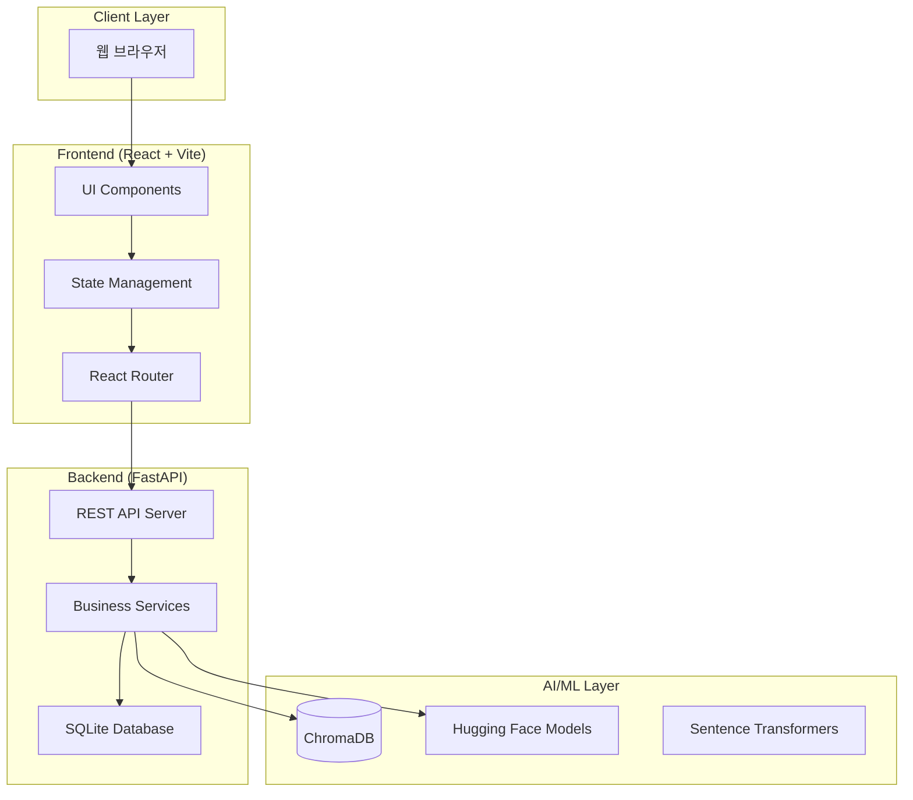

# 🌿 ESG Carbon Dashboard (Carbon Strategic OS)

> **AI 기반 탄소 배출 관리 및 전략적 의사결정 지원 플랫폼**

---

## 📖 1. 프로젝트 개요 (Project Overview)

**ESG Carbon Dashboard**는 기업의 환경적 책임(Environmental)을 데이터 중심의 전략적 자산으로 전환하기 위해 개발된 **Carbon Strategic OS**입니다.

단순히 과거의 배출량을 기록하는 데 그치지 않고, 다음과 같은 핵심 가치를 제공합니다:

- **실시간 트래킹**: 글로벌 탄소 시장(EU-ETS, K-ETS)과 에너지 가격(WTI)을 연동한 실시간 리스크 분석.
- **예측 기반 전략**: AI 모델을 통한 탄소 가격 예측 및 최적의 분할 매수(DCA) 시나리오 제시.
- **재무적 의사결정**: 녹색 투자의 타당성(NPV, ROI)을 정량적으로 산출하여 CFO와 경영진의 투자 판단을 지원.
- **지식 증강 질의응답**: RAG(Retrieval-Augmented Generation) 기술을 통해 비정형 ESG 보고서에서 즉각적인 전략 인사이트를 추출.

이 프로젝트는 개발자뿐만 아니라 ESG 실무자, CFO, 그리고 지속 가능성 전략가가 실무에서 즉시 활용할 수 있는 수준의 **전문 기술 도구**를 목표로 합니다.

---

## � 2. 목차 (Table of Contents)

1. [시스템 아키텍처](#-3-시스템-아키텍처-system-architecture)
2. [핵심 기능 및 설계 의도](#-4-핵심-기능-및-설계-의도-core-features)
   - [Dashboard: 배출량 통합 대시보드](#41-dashboard-tab-배출량-통합-대시보드)
   - [Simulator: 탄소 시장 시뮬레이터](#42-simulator-tab-탄소-시장-시뮬레이터)
   - [Investment: 녹색 투자 분석](#43-investment-tab-녹색-투자-분석)
   - [AI Agent: 지능형 챗봇 및 RAG](#44-chatbot-ai-전략-에이전트)
3. [기술 스택 및 모듈 연동](#-5-기술-스택-및-모듈-연동-tech-stack--implementation)
4. [프로젝트 구조](#-6-프로젝트-구조-project-structure)
5. [설치 및 설정](#-7-설치-및-설정-installation--setup)
6. [API 명세](#-8-api-명세-api-specification)
7. [AI 모델 평가](#-9-ai-모델-평가-ai-model-evaluation)

---

## 📐 3. 시스템 아키텍처 (System Architecture)

### 3.1 전체 파이프라인



---

## 🚀 4. 핵심 기능 및 설계 의도 (Core Features)

### 4.1 Dashboard Tab (배출량 통합 대시보드)

- **역할(Role)**: 기업의 Scope 1, 2, 3 배출 현황 및 리스크 지표 시각화.

- **의도(Purpose)**:
  - **즉각적인 현황 파악**: 경영진이 주요 KPI(총 배출량, 탄소 집약도)를 3초 이내에 파악하도록 설계.
  - **리스크 금액화**: 단순 배출량 수치를 넘어, 현재 탄소 가격을 적용한 **재무적 리스크 금액**을 실시간으로 산출.
- **기술 요소**: Recharts(차트 시각화), 수치 자동 계산 엔진.

### 4.2 Simulator Tab (탄소 시장 시뮬레이터)

- **역할(Role)**: EU-ETS, K-ETS 및 유가 상관관계 분석과 가격 예측.

- **의도(Purpose)**:
  - **시장 리스크 헤징**: 가격 변동성을 활용한 **분할 매수(DCA) 전략** 자동 생성.
  - **시나리오 테스트**: "유가 $100 돌파 시 탄소 가격 영향" 등 가상 시나리오에 따른 재무 영향 분석.
- **기술 요소**: Pandas(상관관계 분석), SMA/Volatility 예측 모델.

### 4.3 Investment Tab (녹색 투자 분석)

- **역할(Role)**: 저감 설비 투자의 NPV(순현재가치), ROI(투자수익률), BEP(손익분기점) 분석.

- **의도(Purpose)**:
  - **재무적 타당성 입증**: 기업 내부의 투자 승인 프로세스를 돕기 위해 ESG 성과를 **재무적 언어**로 번역.
  - **민감도 분석**: 탄소세 부과 여부나 할인율 변화에 따른 수익성 시뮬레이션.
- **기술 요소**: Financial Math Algorithms, Scenario Analysis Engine.

### 4.4 ChatBot (AI 전략 에이전트)

- **역할(Role)**: ESG 공시 자료 기반 RAG 질의응답 및 Text-to-SQL.

- **의도(Purpose)**:
  - **지식 자동화**: 수백 페이지의 PDF 보고서에서 필요한 데이터를 즉시 추출하여 보고서 작성 시간 90% 단축.
  - **데이터 접근성**: SQL을 모르는 실무자도 자연어로 DB 정보를 조회 가능하게 구현.
- **기술 요소**: LangChain, ChromaDB, Sentence-BERT.

---

## 🛠️ 5. 기술 스택 및 모듈 연동 (Tech Stack & Implementation)

본 프로젝트는 각 기능의 전문성을 극대화하기 위해 다음과 같은 기술 결합을 선택했습니다.

### 5.1 Backend & Data Module

- **FastAPI & Uvicorn**: 비동기 처리를 통해 수많은 시장 데이터 수집 및 AI 모델 추론 시 동시 요청 처리 성능 극대화.
- **Market Sourcing Module**:
  - `yfinance`: 글로벌 탄소 선물(`EUA=F`) 및 탄소 ETF(`KRBN`) 수집.
  - `FinanceDataReader`: 국내 탄소 배출권(`KAU`) 및 종목 정보 연동.
- **SQLAlchemy & SQLite**: 경량화된 파일 기반 DB를 사용하여 로격 환경에서의 빠른 데이터 트랜잭션과 마이그레이션 보장.

### 5.2 AI & NLP Module

- **ChromaDB (Vector DB)**: PDF에서 추출된 고차원 텍스트 임베딩을 저장하고, Cosine Similarity 기반의 Semantic Search 수행.
- **Sentence-Transformers**: 한국어 문맥 이해에 최적화된 `jhgan/ko-sroberta-multitask` 모델을 사용하여 질문-본문 간 일치도 향상.
- **Docling & PyMuPDF**: 복잡한 표와 구조를 포함한 ESG 보고서 PDF를 정확하게 파이토닉 데이터로 변환.

### 5.3 Frontend & UI

- **React 19 & TypeScript**: 선언적 UI와 강한 타입 체크를 통해 대규모 데이터 시뮬레이션에서도 렌더링 안정성 확보.
- **TailwindCSS 4**: 모던 디자인 시스템 구축 및 다크 모드/반응형 레이아웃의 직관적 구현.
- **Recharts 3.7**: 대량의 시계열 시장 데이터를 끊김 없이 렌더링하기 위한 전문 차트 라이브러리 사용.

---

## 📂 6. 프로젝트 구조 (Project Structure)

```plaintext
ESG_Dashboard/
├── backend/                    # FastAPI 기반 백엔드 아키텍처
│   ├── app/
│   │   ├── routers/            # API 엔드포인트
│   │   │   ├── simulator.py    # 시장 시뮬레이션 & 탄소 가격 동향
│   │   │   ├── ai.py           # AI 전략 생성 & RAG 챗봇
│   │   │   └── krx.py          # 한국거래소(KRX) 데이터 조회
│   │   ├── services/           # 비즈니스 로직
│   │   │   ├── market_data.py  # 글로벌 탄소 시장 데이터 수집 (EU-ETS, K-ETS)
│   │   │   ├── ai_service.py   # AI 모델 통합 (LLM, RAG)
│   │   │   ├── krx_service.py  # KRX API 연동 (pykrx)
│   │   │   ├── eex_scraper.py  # EEX 탄소 가격 스크래핑
│   │   │   └── oil_price.py    # 유가(WTI, Brent) 데이터 수집
│   │   ├── database.py         # SQLAlchemy 데이터베이스 설정
│   │   ├── config.py           # 환경 변수 및 설정 관리
│   │   └── main.py             # 라우터 통합 및 CORS 설정
│   ├── main.py                 # 메인 FastAPI 서버 (PDF_Extraction 통합)
│   ├── requirements.txt        # Python 의존성 목록
│   └── start.sh                # 서버 시작 스크립트
├── frontend/                   # React 19 기반 프론트엔드 아키텍처
│   ├── src/
│   │   ├── features/           # 기능별 모듈 (한글명 폴더 구조)
│   │   │   ├── 대시보드/       # Dashboard 탭 (배출량 현황)
│   │   │   ├── 경쟁사비교/     # 경쟁사 비교 분석 탭
│   │   │   ├── 시뮬레이터/     # 탄소 시장 시뮬레이터 탭
│   │   │   ├── 목표설정/       # SBTi 목표 관리 탭
│   │   │   ├── 투자계획/       # 녹색 투자 분석 탭
│   │   │   └── 챗봇/           # AI 챗봇 컴포넌트
│   │   ├── components/         # 공용 UI 컴포넌트
│   │   │   ├── layout/         # 레이아웃 (Header 등)
│   │   │   └── ui/             # 재사용 가능한 UI 요소 (Card, Button 등)
│   │   ├── data/
│   │   │   └── mockData.ts     # Mock 데이터
│   │   ├── types/
│   │   │   └── index.ts        # TypeScript 타입 정의
│   │   ├── App.tsx             # 메인 애플리케이션 (전역 상태 관리)
│   │   ├── main.tsx            # React 진입점
│   │   └── index.css           # 전역 스타일
│   ├── index.html
│   ├── vite.config.ts          # Vite 빌드 설정
│   ├── package.json            # Node.js 의존성 목록
│   └── tsconfig.json           # TypeScript 설정
├── PDF_Extraction/             # PDF 처리 및 벡터 DB 통합
│   ├── src/                    # PDF 파싱 파이프라인
│   ├── data/                   # PDF 소스 파일
│   └── vector_db/              # ChromaDB 저장소 (RAG 지식 베이스)
├── evaluation/                 # AI 모델 성능 평가 스크립트
├── .env                        # 환경 변수 (API 키 등)
├── .gitignore
└── README.md
```

---

## ⚙️ 7. 설치 및 설정 (Installation & Setup)

### 7.1 백엔드 가동

```bash
cd backend
python -m venv .venv
# Windows:
.venv\Scripts\activate
# macOS/Linux:
# source .venv/bin/activate

pip install -r requirements.txt
```

**백엔드 서버 실행 (2가지 방법)**:

#### 방법 1: 메인 서버 실행 (PDF_Extraction 통합)

```bash
# backend/main.py 사용 - PDF 문서 검색 및 RAG 기능 포함
python main.py
# 또는
uvicorn main:app --reload --port 8000
```

#### 방법 2: 앱 서버 실행 (시뮬레이터 및 AI 전략)

```bash
# backend/app/main.py 사용 - 시장 시뮬레이션 및 AI 전략 기능
cd app
uvicorn main:app --reload --port 8000
```

> [!NOTE]
>
> - `backend/main.py`: PDF 검색, RAG 챗봇, 문서 관리 API 포함
> - `backend/app/main.py`: 시장 시뮬레이션, KRX 데이터, AI 전략 API 포함
> - 통합 사용을 위해서는 `backend/main.py`를 사용하고 라우터를 병합하는 것을 권장

### 7.2 프론트엔드 가동

```bash
cd frontend
npm install
npm run dev
```

브라우저에서 ``http://localhost:5173 접속

### 7.3 AI 및 RAG 환경 설정 (선택사항)

RAG 챗봇 기능을 사용하려면 다음 설정이 필요합니다:

#### Ollama 설치 및 모델 다운로드

```bash
# Ollama 설치 (https://ollama.ai)
# 설치 후 모델 다운로드
ollama pull qwen2.5:7b
```

#### 벡터 DB 구축

```bash
cd PDF_Extraction
# PDF 파일을 data/ 폴더에 배치
# 벡터 DB 구축 스크립트 실행
python src/build_vector_db.py
```

> [!IMPORTANT]
> ChromaDB는 `PDF_Extraction/vector_db/` 경로에 저장됩니다.
> 이 폴더가 없으면 RAG 기반 챗봇 기능이 작동하지 않습니다.

### 7.4 환경 변수 설정

프로젝트 루트에 `.env` 파일 생성:

```env
# API Keys (필요시)
OPENAI_API_KEY=your_api_key_here

# Database
DATABASE_URL=sqlite:///./esg_dashboard.db

# Ollama
OLLAMA_API_URL=http://localhost:11434

# 벡터 DB 경로
VECTOR_DB_PATH=./PDF_Extraction/vector_db
```

---

## 📊 8. API 명세 (API Specification)

### 8.1 시뮬레이터 API (`/api/v1/sim`)

| 엔드포인트 | 메서드 | 설명 |
| ----------- | ------ | ---- |
| `/dashboard/trend-combined` | GET | 특정 기업의 탄소 배출량 기반 리스크 비용 시뮬레이션 (기간별: 1m, 3m, 1y, all) |
| `/dashboard/market-trends` | GET | 글로벌 탄소 시장 가격 동향 차트 데이터 (EU-ETS, K-ETS) |
| `/market/oil-prices` | GET | 실시간 유가 정보 조회 (Brent, WTI) |

**주요 파라미터**:

- `period`: 조회 기간 (`1m`, `3m`, `1y`, `all`)
- `company`: 기업명 (예: "현대건설")
- `start_year`, `end_year`: 연도별 데이터 조회 범위

### 8.2 AI 전략 API (`/api/v1/ai`)

| 엔드포인트 | 메서드 | 설명 |
| ----------- | ------ | ---- |
| `/strategy` | POST | 시장 동향 분석 기반 최적 탄소 배출권 매수 전략 생성 |
| `/chat` | POST | ESG 문서 기반 RAG 챗봇 (스트리밍 응답) |
| `/text-to-sql` | POST | 자연어를 SQL 쿼리로 자동 변환 |

**Request Body 예시** (`/chat`):

```json
{
  "message": "탄소 배출량 감축 목표를 알려줘"
}
```

**Request Body 예시** (`/strategy`):

```json
{
  "companyId": 1,
  "market": "K-ETS",
  "currentPrice": 15200
}
```

### 8.3 한국거래소 데이터 API (`/api/v1/krx`)

| 엔드포인트 | 메서드 | 설명 |
| ----------- | ------ | ---- |
| `/kospi` | GET | KOSPI 지수 시세 조회 |
| `/kosdaq` | GET | KOSDAQ 지수 시세 조회 |
| `/stocks` | GET | 상장 종목 목록 조회 (상위 50개) |
| `/stock/{ticker}` | GET | 특정 종목의 시세 조회 (예: ticker=005930) |

**주요 파라미터**:

- `date`: 조회 기준일 (YYYYMMDD 형식, 선택)
- `market`: 시장 구분 (`ALL`, `KOSPI`, `KOSDAQ`)

### 8.4 추가 엔드포인트 (backend/main.py)

| 엔드포인트 | 메서드 | 설명 |
|-----------|--------|------|
| `/` | GET | API 서버 상태 확인 |
| `/api/health` | GET | API 헬스 체크 |
| `/api/search` | GET | ESG 문서 벡터 검색 (ChromaDB) |
| `/api/companies` | GET | 데이터베이스 내 기업 목록 조회 |
| `/api/stats` | GET | 데이터베이스 통계 정보 (총 청크 수, 기업 수 등) |

**API 문서 자동 생성**: `http://127.0.0.1:8000/docs` (FastAPI Swagger UI)

---

## 🤖 9. AI 모델 평가 (AI Model Evaluation)

플랫폼의 신뢰성을 위해 탑재된 모델들을 정기적으로 자동 평가합니다.

- **방법**: `python evaluation/evaluate_models.py`
- **평가 항목**: RAG 답변의 정답지(Answer Key) 대비 일치율, 추론 시간, GPU 자원 효율성.

---

**Last Updated**: 2026-02-06  
**License**: Educational & Research Purpose Only
