# 🌿 ESG Carbon Dashboard (Carbon Strategic OS)

> **AI 기반 탄소 배출 관리 및 전략적 의사결정 지원 플랫폼**

---

## 📖 1. 프로젝트 개요 (Project Overview)

**ESG Carbon Dashboard**는 기업의 환경적 책임(Environmental)을 데이터 중심의 전략적 자산으로 전환하기 위해 개발된 **Carbon Strategic OS**입니다.

단순히 과거의 배출량을 기록하는 데 그치지 않고, 다음과 같은 핵심 가치를 제공합니다:

- **실시간 트래킹**: 글로벌 탄소 시장(EU-ETS, K-ETS)과 에너지 가격(WTI)을 연동한 실시간 리스크 분석.
- **경쟁사 벤치마킹**: 탄소 집약도(Carbon Intensity) 기준 동종 업계 내 순위 및 격차 시각화.
- **K-ETS 시뮬레이터**: 순 배출 노출량(Net Exposure) 계산 및 3가지 최적 조달 전략 자동 생성.
- **목표 기반 의사결정**: SBTi 기반 감축 경로와 목표 달성 확률(Monte Carlo)을 정량적으로 제시하여 실행 우선순위 결정 지원.
- **지식 증강 질의응답**: RAG(Retrieval-Augmented Generation) 기술을 통해 비정형 ESG 보고서에서 즉각적인 전략 인사이트를 추출.

이 프로젝트는 개발자뿐만 아니라 ESG 실무자, CFO, 그리고 지속 가능성 전략가가 실무에서 즉시 활용할 수 있는 수준의 **전문 기술 도구**를 목표로 합니다.

---

## 📑 2. 목차 (Table of Contents)

1. [시스템 아키텍처](#-3-시스템-아키텍처-system-architecture)
2. [핵심 기능 및 설계 의도](#-4-핵심-기능-및-설계-의도-core-features)
   - [Dashboard: 배출량 통합 대시보드](#41-dashboard-tab-배출량-통합-대시보드)
   - [Compare: 경쟁사 비교 분석](#42-compare-tab-경쟁사-비교-분석)
   - [Simulator: K-ETS 준수 비용 시뮬레이터](#43-simulator-tab-k-ets-준수-비용-시뮬레이터)
   - [Target: SBTi 목표 관리](#44-target-tab-sbti-목표-관리)
   - [ChatBot: AI 전략 에이전트](#45-chatbot-ai-전략-에이전트)
   - [인증 시스템](#46-인증-시스템-authentication)
   - [프로필 설정](#47-프로필-설정-profile-settings)
3. [기술 스택 및 모듈 연동](#️-5-기술-스택-및-모듈-연동-tech-stack--implementation)
4. [프로젝트 구조](#-6-프로젝트-구조-project-structure)
5. [페이지 라우팅 구조](#️-7-페이지-라우팅-구조-page-routing)
6. [설치 및 설정](#️-8-설치-및-설정-installation--setup)
7. [API 명세](#-9-api-명세-api-specification)
8. [AI 모델 평가](#-10-ai-모델-평가-ai-model-evaluation)

---

## 📐 3. 시스템 아키텍처 (System Architecture)

### 3.1 전체 파이프라인

```mermaid
graph TB
    subgraph "Client Layer"
        Browser[웹 브라우저]
    end

    subgraph "Frontend (React 18 + TypeScript + Vite)"
        UI[UI Components<br/>Recharts / TailwindCSS 4]
        State[State Management<br/>React Hooks + localStorage]
        Router[View State Router<br/>URL Query Params + History API]
    end

    subgraph "Backend (FastAPI + Uvicorn, Port 8000)"
        Auth[Auth Router<br/>/auth]
        Dashboard[Dashboard Router<br/>/api/v1/dashboard]
        Sim[Simulator Router<br/>/api/v1/sim]
        AI[AI Router<br/>/api/v1/ai]
        KRX[KRX Router<br/>/api/v1/krx]
        Profile[Profile Router<br/>/api/v1/profile]
    end

    subgraph "Data & AI Layer"
        MySQL[(MySQL DB<br/>users / dashboard_emissions)]
        ChromaDB[(ChromaDB<br/>Vector Store / RAG)]
        Ollama[Ollama LLM<br/>qwen2.5:7b Local]
        SBERT[Sentence-BERT<br/>jhgan/ko-sroberta-multitask]
    end

    subgraph "External APIs"
        yfinance[yfinance<br/>EU-ETS / EUA Futures]
        FDR[FinanceDataReader<br/>K-ETS / KAU]
        KRXMarket[KRX Market<br/>KOSPI / KOSDAQ]
        OilAPI[Oil Price API<br/>WTI / Brent]
    end

    Browser --> UI
    UI --> State --> Router
    Router -->|Axios HTTP/REST| Auth & Dashboard & Sim & AI & KRX & Profile
    Auth --> MySQL
    Dashboard --> MySQL
    Sim --> yfinance & FDR & OilAPI
    AI --> ChromaDB & Ollama
    ChromaDB --> SBERT
    KRX --> KRXMarket
    Profile --> MySQL
```



---

## 🚀 4. 핵심 기능 및 설계 의도 (Core Features)

### 4.1 Dashboard Tab (배출량 통합 대시보드)

- **역할(Role)**: 기업의 Scope 1, 2, 3 배출 현황 및 재무 리스크 지표를 한눈에 시각화.
- **의도(Purpose)**:
  - **즉각적인 현황 파악**: 경영진이 4개의 KPI 카드(총 배출량, 탄소 집약도, YTD 증감률, SBTi 달성 확률)를 3초 이내에 파악하도록 설계.
  - **리스크 금액화**: 단순 배출량 수치를 넘어, 현재 EU-ETS/K-ETS 가격을 적용한 **재무적 리스크 금액**을 실시간 산출.
  - **궤적 시각화**: 2021년부터의 실제 배출량 추이와 OLS 회귀 예측선, `SBTi 1.5°C` 감축 경로를 동시에 표시. 툴팁에서는 actual 값이 있는 연도의 forecast 중복 표시 제거.
  - **바로가기 카드**: KPI 카드 클릭 시 관련 탭(경쟁사 비교, 시뮬레이터, 목표 관리)으로 즉시 이동.
- **KPI 카드 구성**:
  1. **총 배출량** (Scope 1+2): tCO₂e
  2. **탄소 집약도**: tCO₂e / 매출 1억원 또는 에너지 집약도(TJ/억원) 전환 가능
  3. **YTD 분석**: 전년 대비 % 증감
  4. **SBTi 달성 확률**: Monte Carlo 시뮬레이션 결과 (%)
- **Header UI**: 모든 탭(Dashboard 포함)에 꽃(flower) + 줄기 + 잎 애니메이션 아이콘 표시. Dashboard 탭은 중앙 라벨 `"Home"` 으로 표시. Profile 뷰 진입 시 "Profile Setting" 표시.
- **기술 요소**: Recharts(시계열 차트), 로그-선형 OLS 회귀, Monte Carlo(10,000회), `navigateTo()` 히스토리 연동.

---

### 4.2 Compare Tab (경쟁사 비교 분석)

- **역할(Role)**: 동종 업계 기업 간 탄소 집약도 순위 및 격차를 시각화하여 경쟁 포지션 파악.
- **의도(Purpose)**:
  - **벤치마킹**: 매출 기반 또는 에너지 기반 탄소 집약도로 산업 내 순위 파악.
  - **임계선 표시**: Top 10%(초록), 중앙값(회색), Bottom 10%(빨강) 3개 임계선으로 즉각적인 위치 판단.
  - **데이터 신뢰도**: 데이터 출처별 신뢰 점수(Trust Score) 표시로 데이터 품질 관리.
  - **상세 탐색**: 경쟁사 클릭 시 Scope 1/2/3 세부 내역 프로필 팝업.
  - **전략 연계**: 전략적 인사이트 섹션의 "세부 실행 계획" 버튼 클릭 시 Simulator 탭으로 즉시 이동.
- **집약도 유형 전환**:
  - **Revenue-based**: (Scope 1+2+3) / 매출 1억원 (tCO₂e/억원)
  - **Energy-based**: 에너지 집약도 (TJ/억원)
- **기술 요소**: Recharts(수평 바 차트), 동적 임계선 계산, 기업별 history 배열 활용, `navigateTo('dashboard', 'simulator')` 연동.

---

### 4.3 Simulator Tab (K-ETS 준수 비용 시뮬레이터)

- **역할(Role)**: 글로벌 탄소 시장 동향 조회 및 K-ETS 기반 순 노출량 산출·조달 전략 수립 지원.
- **의도(Purpose)**:
  - **글로벌 가격 동향**: EU-ETS / K-ETS 가격 추이를 시간 범위(1개월/3개월/1년/전체) 별로 선택 조회.
  - **순 노출량 산출**: 조정 배출량 − 조정 할당량 − 실현 가능 감축량 = **Net Exposure**
  - **탄소 가격 시나리오**: 낙관(₩10,000) / 기준(₩15,000) / 비관(₩25,000) 3단계 + 직접 입력 지원.
  - **실시간 시뮬레이션**: 슬라이더/토글 조작 즉시 STEP 4 결과 요약 자동 갱신 (확인 버튼 불필요).
- **4단계 시뮬레이션 흐름**:

  | STEP | 명칭                  | 주요 내용                                                           |
  |:----:|:--------------------- |:------------------------------------------------------------------- |
  | 1    | 직접 탄소 배출량       | KPI 카드 (예상 배출량/순 노출량/예상 비용), 가격 시나리오·배출 변동·할당 정책·경매 상세 설정 |
  | 2    | 전략 배분             | 컴플라이언스(배출권 구매) vs 감축시설 투자 비율 슬라이더              |
  | 3    | 분할 매수 포트폴리오   | 트랜치(Tranche)별 시장·비중·단가 설정, K/EU-ETS 가중평균 구매가·리스크 평정 |
  | 4    | 시뮬레이션 결과 요약   | 최종 탄소비용·탄소 예산 대비·전략 권고 (실시간 자동 갱신)             |

- **감축 수단 옵션** (한계저감비용 MAC 기준):

  | 수단           | MAC (₩/tCO₂e) | 소요 기간 | 당해 적용 |
  |:-------------- |:------------- |:-------- |:-------- |
  | 에너지 효율 개선 | 8,000         | 6개월    | ✅       |
  | 공정 개선      | 12,000         | 9개월    | ✅       |
  | 연료 전환      | 22,000         | 12개월   | ✅       |
  | 재생전력 도입  | 35,000         | 18개월   | ❌       |

- **조달 구성**:
  - 무상 할당 (기준 배출량의 90%), 정부 경매 (시장가 대비 ~2.3% 절감), KRX 시장 구매
  - 경매 참여 비중: 0~30% 슬라이더로 조절 가능
- **기술 요소**: 커스텀 수식 엔진 (App.tsx `simResult` useMemo), Recharts (ComposedChart), yfinance/FDR 시장 데이터 연동.

---

### 4.4 Target Tab (SBTi 목표 관리)

- **역할(Role)**: SBTi 기준연도(2021) 대비 감축 경로와 현재 실적 간 격차를 시각화하고 2030/2050 목표 달성 가능성을 정량화.
- **의도(Purpose)**:
  - **목표 정렬**: 기준 배출량(2021), 현재 배출량, SBTi 목표 달성 여부를 한 화면에서 확인.
  - **확률 기반 판단**: OLS 회귀 + Bayesian 수렴 + Monte Carlo(10,000회) 기반 2030 목표 달성 확률 제공.
  - **Net Zero 2050 추적**: 현재 감축률과 2050 목표(90%+ 감축) 간 격차 실시간 표시.
  - **정확한 목표달성도 판정**: `yearsElapsed` 기준을 현재 연도(2026)가 아닌 최신 데이터 연도(`latestDataYear`, 통상 2024)로 설정하여 동일 연도 기준으로 정확히 판정.
- **KPI 카드 구성**:
  1. **기준 배출량 (2021)**: tCO₂e
  2. **최신 배출량**: tCO₂e + 2021년 대비 % 감축
  3. **SBTi 달성 여부**: On-Track / Off-Track + 목표 대비 격차
  4. **Net Zero 2050**: 필요 총 감축량(90%+), 현재 달성(%), 잔여 격차(%)
- **차트**: 제목 `"온실가스 감축 로드맵 (Net Zero 경로)"`, 방법론 주석 `"온실가스 감축 경로:"` 표시.
- **예측 방법론**:

  ```
  모델: log(E_t) = α + β*t  (로그-선형 OLS 회귀)
  감축 목표: 연간 4.2% (SBTi 절대 감축 기준)
  Monte Carlo: 10,000회 샘플링 → 2030 달성 확률 계산

  Bayesian 업데이트:
    Prior: β_prior = log(1 - 0.042), 가중치 n_prior = 4
    Posterior: (n * β_ols + n_prior * β_prior) / (n + n_prior)
  ```

- **기술 요소**: OLS 회귀, Bayesian 업데이트, Monte Carlo 시뮬레이션(10,000회), Recharts(궤적 차트).

---

### 4.5 ChatBot (AI 전략 에이전트)

- **역할(Role)**: ESG 공시 자료 기반 RAG 질의응답 및 Text-to-SQL.
- **의도(Purpose)**:
  - **지식 자동화**: 수백 페이지의 PDF 보고서에서 필요한 데이터를 즉시 추출하여 보고서 작성 시간 단축.
  - **스트리밍 응답**: 실시간 토큰 출력으로 사용자 대기 시간 최소화.
  - **문맥 유지**: 최근 8개 메시지를 LLM에 전달하여 대화 흐름 유지.
  - **데이터 접근성**: 자연어로 DB 정보를 조회 가능한 Text-to-SQL 기능.
- **RAG 파이프라인**:

  ```
  사용자 질문
    → ChromaDB 코사인 유사도 검색 (Top-5 청크)
    → 검색된 컨텍스트 + 대화 히스토리 + 시스템 프롬프트
    → Ollama (qwen2.5:7b) 스트리밍 추론
    → 실시간 토큰 응답 (fetch ReadableStream)
  ```

- **기술 요소**: ChromaDB, Sentence-BERT (jhgan/ko-sroberta-multitask, 한국어 최적화), Ollama (qwen2.5:7b 로컬 LLM), FastAPI StreamingResponse.

---

### 4.6 인증 시스템 (Authentication)

- **역할(Role)**: 사용자 회원가입, 로그인, JWT 세션 관리.
- **의도(Purpose)**:
  - **접근 제어**: 인증된 사용자만 대시보드 기능에 접근 가능.
  - **개인화**: 사용자별 프로필 설정 및 기업 컨텍스트 연동.
- **인증 흐름**:

  ```
  Signup → bcrypt(password) → User 저장(MySQL)
  Login  → bcrypt 검증 → JWT 발급 (HS256, 24h 유효)
         → localStorage 저장 → WelcomePage 이동 (3초 자동)
  Refresh → token 존재 시 dashboard 자동 복원
  ```

- **기술 요소**: bcrypt(비밀번호 해싱), JWT(python-jose), SQLAlchemy (User 모델).

---

### 4.7 프로필 설정 (Profile Settings)

- **역할(Role)**: 사용자 닉네임, 분류, 자기소개, 프로필 이미지 등 개인 정보 관리.
- **의도(Purpose)**:
  - **사용자 경험**: 독립된 사이드바 네비게이션(Header 아래 고정, `top-28 z-40`)과 직관적인 편집 UI 제공.
  - **ESG 아이덴티티**: 멸종위기종(포유류/조류/양서류 등) 테마를 적용하여 환경적 메시지 전달.
  - **동적 퀴즈 뱃지(QuizBadge)**: 닉네임에서 동물 키워드(눈표범/물방개/판다/호랑이/독수리) 감지 시 해당 멸종위기 동물 퀴즈 표시, 미감지 시 탄소중립 기본 퀴즈 표시. 아이콘 클릭으로 열고 외부 클릭 또는 X로 닫음.
  - **회원 탈퇴**: 확인 모달(비밀번호 재확인)과 함께 계정 삭제 지원.
- **프로필 필드**: 닉네임, 멸종위기종 분류(드롭다운), 소속 기업명(API 목록 드롭다운 선택), 자기소개(500자), 프로필 이미지 URL.
- **기술 요소**: multipart/form-data 이미지 업로드 (`/static/profile/`), React State, FastAPI 파일 핸들링.

---

## 🛠️ 5. 기술 스택 및 모듈 연동 (Tech Stack & Implementation)

### 5.1 Frontend

| 기술                              | 버전    | 용도                                                             |
|:--------------------------------- |:------- |:--------------------------------------------------------------- |
| **React**                         | 18      | 선언적 UI 및 컴포넌트 기반 아키텍처                               |
| **TypeScript**                    | 5.2     | 강한 타입 체크로 대규모 시뮬레이션에서도 렌더링 안정성 확보         |
| **Vite**                          | 5.1     | 빠른 HMR 및 최적화된 프로덕션 빌드                               |
| **TailwindCSS**                   | 4.0     | 모던 디자인 시스템, 다크 모드/반응형 레이아웃 직관적 구현          |
| **Recharts**                      | 2.12    | 시계열 시장 데이터 및 비교 차트 (Line, Bar, Pie, Area)            |
| **Axios**                         | 1.6.7   | REST API 통신 및 JWT 인터셉터                                    |
| **Framer Motion**                 | -       | 페이지 전환 및 컴포넌트 애니메이션                               |
| **Lucide React**                  | -       | 아이콘 라이브러리                                                |
| **CVA (class-variance-authority)** | -      | 조건부 Tailwind 클래스 관리                                      |

### 5.2 Backend & Data

| 기술                              | 용도                                                                         |
|:--------------------------------- |:---------------------------------------------------------------------------- |
| **FastAPI & Uvicorn**             | 비동기 처리로 시장 데이터 수집 및 AI 모델 추론 동시 요청 처리 성능 극대화      |
| **SQLAlchemy & MySQL (PyMySQL)**  | 사용자/배출량 데이터 저장 및 ORM 트랜잭션 처리                               |
| **yfinance**                      | 글로벌 탄소 선물(FCO2.FRK, CO2.L, FCO2.DE) 및 에너지 가격 데이터             |
| **FinanceDataReader (pykrx)**     | 국내 K-ETS 배출권(KAU) 및 KOSPI/KOSDAQ 종목 데이터                          |
| **Alpha Vantage**                 | EU-ETS 탄소 가격 보조 데이터 소스 (다중 fallback 설계)                       |
| **passlib & bcrypt**              | 안전한 비밀번호 해싱 및 사용자 인증                                           |
| **python-jose**                   | JWT 토큰 생성 및 검증 (HS256)                                                |

### 5.3 AI & NLP

| 기술                              | 용도                                                                         |
|:--------------------------------- |:---------------------------------------------------------------------------- |
| **Ollama (qwen2.5:7b)**           | 로컬 LLM 추론 (클라우드 API 없이 온프레미스 동작)                            |
| **ChromaDB**                      | PDF에서 추출된 텍스트 임베딩 저장 및 코사인 유사도 기반 시맨틱 검색            |
| **Sentence-Transformers**         | 한국어 문맥 이해에 최적화된 `jhgan/ko-sroberta-multitask` 모델 사용           |
| **Docling & PyMuPDF**             | 복잡한 표와 구조를 포함한 ESG 보고서 PDF를 파이토닉 데이터로 변환             |

---

## 📂 6. 프로젝트 구조 (Project Structure)

```plaintext
ESG_Dashboard/
├── requirements.txt              # 공통 Python 의존성 (backend + PDF_Extraction)
├── .env                          # 환경 변수 (API 키, DB 접속 정보 등)
├── .gitignore
├── 페이지_라우팅_구조.md         # 페이지 라우팅 상세 설계서 (Korean)
│
├── backend/                      # FastAPI 기반 백엔드
│   ├── app/
│   │   ├── routers/              # API 엔드포인트 라우터
│   │   │   ├── auth.py           #   POST /auth/signup, /auth/login
│   │   │   ├── dashboard.py      #   GET /api/v1/dashboard/companies, /benchmarks
│   │   │   ├── simulator.py      #   GET /api/v1/sim/market-trends, /oil-prices
│   │   │   ├── ai.py             #   POST /api/v1/ai/chat, /strategy, /text-to-sql
│   │   │   ├── krx.py            #   GET /api/v1/krx/kospi, /kosdaq, /stock/{ticker}
│   │   │   └── profile.py        #   PUT/DELETE /api/v1/profile
│   │   ├── services/             # 비즈니스 로직
│   │   │   ├── market_data.py    #   EU-ETS / K-ETS 데이터 수집 (4중 fallback)
│   │   │   ├── ai_service.py     #   RAG 검색, Ollama LLM 스트리밍
│   │   │   ├── krx_service.py    #   KRX API 연동 (pykrx)
│   │   │   ├── oil_price.py      #   WTI / Brent 유가 데이터
│   │   │   ├── eex_scraper.py    #   EEX 탄소 가격 스크래핑
│   │   │   ├── emission_extractor.py # PDF → 데이터 추출 파이프라인
│   │   │   └── extractors/       #   추출 방법별 전략 패턴
│   │   │       ├── regex.py      #     정규식 기반 추출
│   │   │       ├── gpt_text.py   #     GPT 텍스트 추출
│   │   │       ├── gpt_vision.py #     GPT Vision (표 OCR)
│   │   │       └── auto_pipeline.py #  자동 fallback 파이프라인
│   │   ├── models.py             # SQLAlchemy ORM (User, DashboardEmission)
│   │   ├── database.py           # DB 연결 설정
│   │   ├── config.py             # 환경 변수 및 설정 관리
│   │   ├── schemas.py            # Pydantic 요청/응답 모델
│   │   ├── main.py               # FastAPI 앱 + 라우터 등록 + CORS 설정
│   │   ├── init_db.py            # DB 초기화 및 시드 데이터
│   │   └── static/               # 정적 파일 (프로필 이미지)
│   ├── main.py                   # 메인 진입점 (PDF_Extraction 통합)
│   ├── requirements.txt          # Backend 전용 Python 의존성
│   ├── test_api.py               # API 테스트 스크립트
│   └── start.sh                  # 서버 시작 스크립트
│
├── frontend/                     # React 기반 프론트엔드
│   ├── src/
│   │   ├── features/             # 기능별 모듈 (한글명 폴더 구조)
│   │   │   ├── auth/             #   Login, Signup, WelcomePage
│   │   │   ├── profile/          #   Profile 설정 페이지
│   │   │   ├── 대시보드/          #   Dashboard 탭
│   │   │   │   └── components/   #     KPICards, EmissionPieChart, TrendChart
│   │   │   ├── 경쟁사비교/        #   Compare 탭 (경쟁사 분석)
│   │   │   ├── 시뮬레이터/        #   Simulator 탭 (K-ETS 비용 시뮬레이션)
│   │   │   ├── 목표설정/          #   Target 탭 (SBTi 목표 관리)
│   │   │   ├── 챗봇/             #   ChatBot (AI RAG 챗봇)
│   │   │   ├── data-input/       #   데이터 입력 폼
│   │   │   ├── reports/          #   ESG 리포트 뷰어
│   │   │   └── analytics/        #   분석 페이지
│   │   ├── services/             # API 통신 모듈
│   │   │   ├── api.ts            #   MarketService, AiService
│   │   │   ├── authApi.ts        #   인증 API (login, signup, token)
│   │   │   └── profileApi.ts     #   프로필 API
│   │   ├── components/           # 공용 UI 컴포넌트
│   │   │   ├── layout/           #   Header, Layout
│   │   │   └── ui/               #   Button, Card, Tooltip, Badge
│   │   ├── data/
│   │   │   └── mockData.ts       #   Mock 데이터 및 가격 시나리오
│   │   ├── types/
│   │   │   └── index.ts          #   TypeScript 타입 (ViewType, TabType 등)
│   │   ├── App.tsx               # 메인 앱 (전역 상태 & 네비게이션)
│   │   ├── main.tsx              # React 진입점
│   │   └── index.css             # 전역 스타일
│   ├── index.html
│   ├── vite.config.ts            # Vite 빌드 설정
│   ├── package.json              # Node.js 의존성 목록
│   └── tsconfig.json             # TypeScript 설정
│
├── PDF_Extraction/               # PDF 처리 및 벡터 DB 구축
│   ├── src/
│   │   ├── build_vector_db.py    #   ChromaDB 임베딩 구축 스크립트
│   │   └── search_vector_db.py   #   벡터 검색 인터페이스
│   ├── data/                     #   입력 PDF 파일 (ESG 보고서)
│   ├── vector_db/                #   ChromaDB 저장소 (RAG 지식 베이스)
│   └── requirements.txt          #   PDF 전용 Python 의존성
│
└── evaluation/                   # AI 모델 성능 평가
    └── evaluate_models.py        #   RAG 정확도 및 모델 성능 측정
```

---

## 🗺️ 7. 페이지 라우팅 구조 (Page Routing)

> React Router 미사용 — `view` state 기반 조건부 렌더링 방식
> 상세 설계서: [`페이지_라우팅_구조.md`](페이지_라우팅_구조.md)

### 7.1 View 라우팅 (최상위 화면 전환)

| `view` 값     | 컴포넌트          | 설명                            |
|:------------- |:----------------- |:------------------------------- |
| `login`       | `<Login>`         | 로그인 화면 (기본값)             |
| `signup`      | `<Signup>`        | 회원가입 화면                    |
| `welcome`     | `<WelcomePage>`   | 환영 페이지 (3초 후 자동 이동)   |
| `dashboard`   | 탭 대시보드       | 메인 대시보드 (4개 탭)           |
| `profile`     | `<Profile>`       | 프로필 설정                      |
| `data-input`  | `<DataInput>`     | 데이터 입력                      |
| `reports`     | `<Reports>`       | ESG 리포트 뷰어                  |
| `analytics`   | `<Analytics>`     | 분석 페이지                      |

### 7.2 Tab 라우팅 (`view === 'dashboard'` 내부)

| `activeTab`  | 컴포넌트           | 설명                              |
|:------------ |:------------------ |:--------------------------------- |
| `dashboard`  | `<DashboardTab>`   | 배출량 현황 + KPI 카드 4개         |
| `compare`    | `<CompareTab>`     | 경쟁사 비교 분석                   |
| `simulator`  | `<SimulatorTab>`   | K-ETS 준수 비용 시뮬레이터         |
| `target`     | `<TargetTab>`      | SBTi 목표 관리 + 예측              |

### 7.3 네비게이션 핵심 함수

```typescript
// view 변경 + URL 히스토리 동시 기록
const navigateTo = useCallback((newView: ViewType, newTab: TabType = activeTab) => {
  setView(newView);
  setActiveTab(newTab);
  window.history.pushState(
    { view: newView, activeTab: newTab },
    '',
    `?view=${newView}&tab=${newTab}`
  );
}, [activeTab]);
```

### 7.4 상태 저장 방식

| 저장 위치          | 저장 대상              | 용도                          |
|:------------------ |:---------------------- |:----------------------------- |
| `localStorage`     | `view`, `activeTab`    | 새로고침 시 복원               |
| `window.history`   | `{ view, activeTab }`  | 브라우저 뒤로/앞으로 가기      |
| URL query string   | `?view=...&tab=...`    | 현재 위치를 URL로 표현         |

---

## ⚙️ 8. 설치 및 설정 (Installation & Setup)

### 8.0 사전 요구사항 (Prerequisites)

| 소프트웨어   | 최소 버전 | 용도                                 |
|:----------- |:-------- |:------------------------------------ |
| Python       | 3.10+    | 백엔드 서버 및 AI 모델               |
| Node.js      | 18+      | 프론트엔드 빌드                      |
| MySQL        | 5.7+     | 사용자 및 배출량 데이터 저장          |
| Ollama       | 최신     | 로컬 LLM (qwen2.5:7b) 실행           |

### 8.1 백엔드 가동

```bash
cd backend
python -m venv .venv

# Windows:
.venv\Scripts\activate
# macOS / Linux:
# source .venv/bin/activate

pip install -r ../requirements.txt
pip install -r requirements.txt

# DB 초기화 (최초 1회)
python init_db.py
```

**백엔드 서버 실행 (2가지 방법)**:

#### 방법 1: 앱 서버 실행 (권장 — 대시보드, 시뮬레이터, AI, KRX)

```bash
# backend/app/main.py 사용
cd app
uvicorn main:app --reload --port 8000
```

#### 방법 2: 메인 서버 실행 (PDF_Extraction 통합)

```bash
# backend/main.py 사용 — PDF 문서 검색 및 RAG 기능 포함
python main.py
# 또는
uvicorn main:app --reload --port 8000
```

> [!NOTE]
> - `backend/app/main.py`: 시장 시뮬레이션, 대시보드, KRX 데이터, AI 전략, 인증, 프로필 API 포함
> - `backend/main.py`: PDF 검색, RAG 챗봇, 문서 관리 기능 추가 통합

### 8.2 프론트엔드 가동

```bash
cd frontend
npm install
npm run dev
```

브라우저에서 `http://localhost:5173` 접속

### 8.3 AI 및 RAG 환경 설정 (선택사항)

RAG 챗봇 기능을 사용하려면 다음 설정이 필요합니다:

#### Ollama 설치 및 모델 다운로드

```bash
# Ollama 설치: https://ollama.ai
# 설치 후 모델 다운로드
ollama pull qwen2.5:7b
```

#### 벡터 DB 구축

```bash
cd PDF_Extraction

# 의존성 설치 (최초 1회)
pip install -r ../requirements.txt

# PDF 파일을 data/ 폴더에 배치 후 벡터 DB 구축
python src/build_vector_db.py
```

> [!IMPORTANT]
> ChromaDB는 `PDF_Extraction/vector_db/` 경로에 저장됩니다.
> 이 폴더가 없으면 RAG 기반 챗봇 기능이 작동하지 않습니다.

### 8.4 환경 변수 설정

프로젝트 루트에 `.env` 파일 생성:

```env
# --- Database (MySQL) ---
DB_HOST=localhost
DB_PORT=3306
DB_USER=root
DB_PASSWORD=your_password
DB_NAME=esg

# --- Frontend API Base URL ---
VITE_API_BASE_URL=http://127.0.0.1:8000

# --- JWT Secret ---
JWT_SECRET_KEY=your_jwt_secret_key_here

# --- Ollama (Local LLM) ---
OLLAMA_API_URL=http://localhost:11434

# --- Vector DB (ChromaDB) ---
CHROMA_HOST=localhost
CHROMA_PORT=3214
VECTOR_DB_PATH=./PDF_Extraction/vector_db

# --- External Market Data APIs ---
Alpha_Vantage_API=your_alpha_vantage_key   # EU-ETS 탄소 가격
KRX_api=your_krx_api_key                   # 한국거래소 데이터
Oil_Price_API=your_oil_price_api_key       # WTI / Brent 유가

# --- AI (OpenAI, HuggingFace - 선택사항) ---
OPENAI_API_KEY=sk-...
HF_TOKEN=hf_...
```

---

## 📊 9. API 명세 (API Specification)

> FastAPI Swagger UI: `http://127.0.0.1:8000/docs`

### 9.1 인증 API (`/auth`)

| 엔드포인트      | 메서드 | 요청 Body                        | 설명                     |
|:--------------- |:------ |:-------------------------------- |:------------------------ |
| `/auth/signup`  | POST   | `{ email, password }`            | 회원가입                  |
| `/auth/login`   | POST   | `{ email, password }`            | 로그인 → JWT 반환         |

### 9.2 대시보드 API (`/api/v1/dashboard`)

| 엔드포인트                    | 메서드 | 파라미터        | 설명                                          |
|:----------------------------- |:------ |:--------------- |:--------------------------------------------- |
| `/api/v1/dashboard/companies` | GET    | -               | 전체 기업 배출량 목록 (history 배열 포함)      |
| `/api/v1/dashboard/benchmarks`| GET    | `company_id`    | 업계 벤치마크 임계선 (Top10%, 중앙값, Bottom10%) |

**응답 예시** (`/companies` 단일 항목):

```json
{
  "id": 1,
  "name": "현대건설",
  "s1": 75000,
  "s2": 45000,
  "s3": 130684,
  "revenue": 500000000000,
  "baseEmissions": 250684,
  "carbon_intensity_scope1": 15.0,
  "carbon_intensity_scope2": 9.0,
  "carbon_intensity_scope3": 26.1,
  "history": [
    { "year": 2021, "s1": 80000, "s2": 48000, "s3": 140000 },
    { "year": 2022, "s1": 77000, "s2": 46000, "s3": 135000 }
  ]
}
```

### 9.3 시뮬레이터 API (`/api/v1/sim`)

| 엔드포인트                         | 메서드 | 파라미터                         | 설명                                               |
|:----------------------------------- |:------ |:-------------------------------- |:-------------------------------------------------- |
| `/api/v1/sim/dashboard/market-trends` | GET  | `period` (1m/3m/1y/all)          | EU-ETS / K-ETS 전체 이력 데이터 (프론트에서 1개월/3개월/1년/전체 필터링) |
| `/api/v1/sim/market/oil-prices`      | GET   | -                                | WTI / Brent 유가 정보                             |
| `/api/v1/sim/dashboard/trend-combined` | GET | `company`, `period`              | 기업별 탄소 리스크 비용 시뮬레이션                 |

**응답 예시** (`/market-trends`):

```json
{
  "chart_data": [
    { "date": "2024-01-15", "krPrice": 14200, "euPrice": 62.3, "type": "actual" },
    { "date": "2024-01-16", "krPrice": 14350, "euPrice": 63.1, "type": "actual" }
  ]
}
```

### 9.4 AI 전략 API (`/api/v1/ai`)

| 엔드포인트             | 메서드 | 설명                                                      |
|:---------------------- |:------ |:--------------------------------------------------------- |
| `/api/v1/ai/chat`      | POST   | ESG 문서 기반 RAG 챗봇 (스트리밍 응답)                   |
| `/api/v1/ai/strategy`  | POST   | 시장 동향 분석 기반 최적 탄소 배출권 조달 전략 생성        |
| `/api/v1/ai/text-to-sql` | POST | 자연어를 SQL 쿼리로 자동 변환                             |

**Request Body** (`/chat`):

```json
{
  "message": "탄소 배출량 감축 목표를 알려줘",
  "history": [
    { "role": "user", "content": "이전 질문" },
    { "role": "assistant", "content": "이전 답변" }
  ],
  "companyName": "현대건설",
  "reportScope": "all",
  "reportYear": "2023"
}
```

**Request Body** (`/strategy`):

```json
{
  "companyId": 1,
  "market": "K-ETS",
  "currentPrice": 15200
}
```

### 9.5 한국거래소 데이터 API (`/api/v1/krx`)

| 엔드포인트              | 메서드 | 파라미터                              | 설명                              |
|:----------------------- |:------ |:------------------------------------- |:--------------------------------- |
| `/api/v1/krx/kospi`     | GET    | `date` (YYYYMMDD, 선택)               | KOSPI 지수 시세 조회              |
| `/api/v1/krx/kosdaq`    | GET    | `date` (YYYYMMDD, 선택)               | KOSDAQ 지수 시세 조회             |
| `/api/v1/krx/stocks`    | GET    | `market` (ALL/KOSPI/KOSDAQ)           | 상장 종목 목록 (상위 50개)        |
| `/api/v1/krx/stock/{ticker}` | GET | `ticker` (예: 005930)               | 특정 종목 시세 조회               |

### 9.6 프로필 API (`/api/v1/profile`)

| 엔드포인트              | 메서드 | 설명                                                 |
|:----------------------- |:------ |:--------------------------------------------------- |
| `/api/v1/profile`       | PUT    | 프로필 정보 수정 (닉네임, 분류, 자기소개, 이미지)     |
| `/api/v1/profile`       | DELETE | 계정 삭제 (탈퇴)                                     |

### 9.7 추가 엔드포인트 (`backend/main.py`)

| 엔드포인트         | 메서드 | 설명                                              |
|:------------------ |:------ |:----------------------------------------------- |
| `/`                | GET    | API 서버 상태 확인                               |
| `/api/health`      | GET    | API 헬스 체크                                    |
| `/api/search`      | GET    | ESG 문서 벡터 검색 (ChromaDB, `q` 파라미터)      |
| `/api/companies`   | GET    | 데이터베이스 내 기업 목록 조회                    |
| `/api/stats`       | GET    | 데이터베이스 통계 (총 청크 수, 기업 수 등)        |

---

## 🤖 10. AI 모델 평가 (AI Model Evaluation)

플랫폼의 신뢰성을 위해 탑재된 모델들을 정기적으로 자동 평가합니다.

- **실행 방법**: `python evaluation/evaluate_models.py`
- **평가 항목**:
  - RAG 답변의 정답지(Answer Key) 대비 일치율
  - Monte Carlo 수렴 안정성 (10,000회)
  - OLS 회귀 계수 유의성 및 잔차 분석
  - 추론 시간 및 메모리 효율성

---

## 📌 DB 스키마 주요 테이블

### `users`

| 컬럼명              | 타입         | 설명                         |
|:------------------- |:------------ |:---------------------------- |
| `id`                | INT (PK)     | 사용자 ID                    |
| `email`             | VARCHAR (UQ) | 이메일 (로그인 식별자)        |
| `company_name`      | VARCHAR      | 소속 기업명                  |
| `hashed_password`   | VARCHAR      | bcrypt 해시 비밀번호          |
| `nickname`          | VARCHAR      | 닉네임                       |
| `classification`    | VARCHAR      | 멸종위기종 분류 테마          |
| `bio`               | TEXT         | 자기소개 (최대 500자)        |
| `profile_image_url` | VARCHAR      | 프로필 이미지 경로            |
| `created_at`        | DATETIME     | 가입일시                     |

### `dashboard_emissions`

| 컬럼명                        | 타입     | 설명                           |
|:----------------------------- |:-------- |:------------------------------ |
| `id`                          | INT (PK) | 레코드 ID                      |
| `company_id`                  | INT      | 기업 ID                        |
| `company_name`                | VARCHAR  | 기업명                         |
| `year`                        | INT      | 데이터 기준 연도               |
| `scope1`, `scope2`, `scope3`  | FLOAT    | Scope별 배출량 (tCO₂e)        |
| `allowance`                   | FLOAT    | 무상 할당량 (tCO₂e)           |
| `revenue`                     | FLOAT    | 매출액 (원)                    |
| `carbon_intensity_scope1`     | FLOAT    | Scope 1 탄소 집약도 (tCO₂e/억원) |
| `carbon_intensity_scope2`     | FLOAT    | Scope 2 탄소 집약도 (tCO₂e/억원) |
| `carbon_intensity_scope3`     | FLOAT    | Scope 3 탄소 집약도 (tCO₂e/억원) |
| `energy_intensity`            | FLOAT    | 에너지 집약도 (TJ/억원)        |
| `base_year`                   | INT      | SBTi 기준 연도                 |
| `base_emissions`              | FLOAT    | 기준 연도 총 배출량            |
| `data_source`                 | VARCHAR  | 데이터 출처 (PDF명 등)         |
| `is_verified`                 | BOOLEAN  | 검증 여부                      |

---

**📅 Last Updated**: 2026-02-19
**📄 License**: Educational & Research Purpose Only
